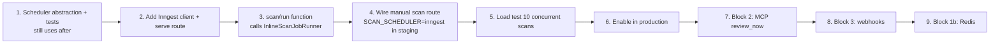

# SequrAI Infrastructure Migration Plan

**Version:** 1.0  
**Date:** 2026-07-23  
**Prerequisite reading:** [Scaling Audit](./scaling-audit.md), [Target Architecture](./target-architecture.md)  
**Rule:** No production cutover without feature flags and rollback path.

---

## Goals

1. Move scan/review compute **off Vercel serverless** without rewriting domain logic.
2. Introduce **durable orchestration** (Inngest) before external workers.
3. Preserve **Production Verdict determinism** and **MCP ADR-001** contracts throughout.
4. Reach **10K active users** without emergency re-architecture.
5. Keep a **clean path to 100K+** via horizontal worker scaling and data plane separation.

---

## Non-goals (explicit)

- Rewriting `brain/production-verdict/engine.ts` or scanner rules in Phase 0–2
- Migrating auth to Clerk in Block 1
- Migrating Postgres to Neon before Inngest is stable
- Building AI Router before scan orchestration is durable

---

## Phase overview

| Phase | Timeline | Users | Outcome |
|---|---|---|---|
| **0 — Stabilize** | 1–2 weeks | 100–500 | Predictable scans; config fixes; observability baseline |
| **1 — Durable orchestration** | 2–3 weeks | 500–2K | Inngest owns scan scheduling; Redis for locks/limits |
| **2 — Compute extraction** | 3–4 weeks | 2K–10K | Fly workers; domain-parallel scans; AI router v1 |
| **3 — Data plane scale** | 4–6 weeks | 10K–50K | Neon, ClickHouse, R2, Stripe meters, notifications |
| **4 — Enterprise & 100K** | Ongoing | 50K–100K+ | Clerk/WorkOS, multi-region, tenant isolation |

---

## Phase 0 — Stabilize monolith

**Objective:** Fix immediate production risks before adding vendors.

### Tasks

| # | Task | Files / systems | Exit criteria |
|---|---|---|---|
| 0.1 | Resolve `vercel.json` vs route `maxDuration` conflict | `vercel.json`, scan/webhook routes | Documented effective limit in staging; scans complete on medium repo |
| 0.2 | Add structured logging for scan lifecycle | `scan-job-runner.ts`, webhook orchestrator | Every scan logs: `scan_id`, `trigger`, `duration_ms`, `status` |
| 0.3 | Introduce `SCAN_SCHEDULER` env (default `inline`) | `lib/env/scan-scheduler.ts`, `.env.example` | Flag exists; no behavior change yet |
| 0.4 | Dashboard for stuck scans (query) | Optional admin script or SQL runbook | Ops can find `active_scan_id` stuck > 30 min |
| 0.5 | Validate encryption key in all envs | `scripts/validate-env.mjs` | Staging/prod fail fast if encrypted tokens but no key |

### Rollback

Config-only changes; revert `vercel.json` if needed.

### Do not start Phase 1 until

- Manual Production Review completes reliably in staging under load test (≥10 concurrent requests)

---

## Phase 1 — Durable orchestration shell ✅ IMPLEMENTED

**Objective:** Replace `after(InlineScanJobRunner)` with Inngest while **reusing the same runner code**.

**Delivered:**
- `scan_jobs` table (migration `020`) with states `queued | running | completed | failed | cancelled`
- GitHub delivery idempotency at ingress + unique `webhook_process` jobs per delivery
- Inngest functions: `scan/run`, `github/webhook.process`
- Shared scheduler: `server/jobs/schedule-scan.ts` with `SCAN_SCHEDULER=inline` rollback
- Wired paths: manual scans, MCP `review_now`, webhooks, autopilot push reviews
- Tests: duplicate webhooks, job failure/completion, scheduler modes
- Per-route `vercel.json` maxDuration (webhook 30s, inngest 300s)

**Not in Phase 1 (deferred to Phase 2+):** Redis locks, Fly workers, ClickHouse, AI router, Neon migration.

### Block 1 — Manual scans only (safest first cutover)

See [Block 1 detailed plan](#block-1--manual-scans-only-first-cutover) below.

### Block 2 — MCP `review_now`

| Change | Files |
|---|---|
| Route MCP scans through shared scheduler | `server/review-now/trigger-review.ts`, `server/jobs/schedule-scan.ts` |
| Tests | `server/review-now/__tests__/*`, `server/mcp/__tests__/review-now.test.ts` |

**Exit criteria:** MCP `review_now` survives Vercel timeout; retries visible in Inngest UI.

### Block 3 — GitHub webhooks + Continuous Reviews

| Change | Files |
|---|---|
| Webhook ack only; emit Inngest events | `app/api/webhooks/github/route.ts` |
| Orchestrator stops inline runner | `server/github-automation/orchestrator.ts` |
| Automatic review emits `scan/run` | `server/automatic-review/run-on-push.ts` |

**Exit criteria:** Push webhook ack < 200ms p99; autopilot reviews complete via Inngest; idempotency preserved.

### Block 1b — Upstash Redis (same phase, after Block 1 stable)

| Change | Purpose |
|---|---|
| Scan lock `SET NX` | Replace race-prone DB-only concurrency |
| Org scan rate limit | Replace in-memory limiter for scans |
| GitHub ETag cache | Reduce API rate limit pressure |

**New files:** `lib/redis/client.ts`, `server/cache/github-api-cache.ts`, `server/http/org-rate-limit.ts`

**Exit criteria:** Rate limits consistent across Vercel instances; GitHub 403 rate reduced in logs.

### Phase 1 dependencies

```bash
# New env vars
INNGEST_EVENT_KEY=
INNGEST_SIGNING_KEY=
SCAN_SCHEDULER=inline|inngest   # start inline, flip to inngest
UPSTASH_REDIS_REST_URL=         # Block 1b
UPSTASH_REDIS_REST_TOKEN=
```

### Phase 1 rollback

Set `SCAN_SCHEDULER=inline` → restores `after()` path. Inngest functions remain deployed but unused.

---

## Phase 2 — Compute extraction

**Objective:** Move CPU-heavy work off Inngest/Vercel into dedicated workers.

### Tasks

| # | Task | Description |
|---|---|---|
| 2.1 | Fly.io `sequrai-scan` service | HTTP or Inngest-invoked worker running scan domains |
| 2.2 | Split `InlineScanJobRunner` into orchestrator + domain jobs | Inngest fan-out: `scan.domain.auth`, `scan.domain.secrets`, … |
| 2.3 | R2 artifact store | Repo snapshot + large omission logs; pointer in `scans` row |
| 2.4 | AI Router v1 | Separate service; `ai-analysis` route enqueues only |
| 2.5 | Safe Fix worker | `safefix/generate` job; persists to existing tables |
| 2.6 | Verdict worker (optional split) | Thin wrapper calling existing `generateAndPersistProductionVerdict` |

### Domain parallelization (target)

```
scan.start
  ├── scan.domain.auth
  ├── scan.domain.payments
  ├── scan.domain.database
  ├── scan.domain.secrets
  ├── scan.domain.infrastructure
  └── scan.domain.production
scan.aggregate → ai.analyze → verdict.generate → notify
```

**Reuse:** `features/security-scanner/rules/*` — group rules by domain tag (may require rule metadata addition).

### Exit criteria

- 500 concurrent scans in load test
- Medium repo p95 time to verdict < 3 min
- Vercel function duration for API routes < 5s p99

---

## Phase 3 — Data plane scale

**Objective:** Relieve Postgres pressure; enable billing and analytics.

### Tasks

| # | Task | Risk | Mitigation |
|---|---|---|---|
| 3.1 | Migrate Postgres hosting Supabase → Neon | Connection string change | Branch migration; dual-write read-only validation |
| 3.2 | Keep Supabase Auth temporarily | Auth decoupled from DB host | No auth migration in same window |
| 3.3 | ClickHouse for `repository_events`, AI cost, SLI metrics | New pipeline | Dual-write events from Inngest steps |
| 3.4 | Stripe metered billing | Usage accuracy | `usage.record` Inngest step → Stripe |
| 3.5 | Wire Resend notifications | User-visible | Replace stub in `server/github-automation/notifications.ts` |
| 3.6 | Archive old findings to R2 | Migration script | Batch job; keep verdict summary in PG |

### Database migration procedure (Supabase → Neon)

1. Create Neon project; apply migrations `001`–`019` on branch  
2. Logical replication or pg_dump/restore to Neon staging  
3. Point staging app to Neon; run full test suite + E2E onboarding  
4. Maintenance window: freeze writes, final sync, swap `DATABASE_URL`  
5. Keep Supabase project read-only 7 days for rollback  

**Do not** re-run migration `004` on any production database.

### Exit criteria

- 10K active users supported in load model  
- Per-org cost visible in ClickHouse dashboard  
- Postgres CPU < 60% p95 at peak  

---

## Phase 4 — Enterprise & 100K+

| Task | When |
|---|---|
| Clerk + org sync webhooks | Enterprise sales motion starts |
| WorkOS SSO / SCIM | First enterprise contract |
| Dedicated Neon branch per enterprise tenant | Contractual isolation requirement |
| Multi-region Fly workers (US + EU) | EU customers > 20% |
| Cloudflare Queues webhook buffer | Webhook QPS > 1K/s sustained |
| SOC 2 Type II | Post-10K ARR milestone |

---

## Block 1 — Manual scans only (first cutover)

### Why Block 1 first

| Criterion | Manual scan path |
|---|---|
| Blast radius | Smallest — one API route |
| User visibility | Highest — onboarding + project reviews |
| Schema migration | None required |
| Rollback | `SCAN_SCHEDULER=inline` |
| Touches webhooks | No — avoids push flood |
| Reuses runner | Yes — `InlineScanJobRunner` unchanged |

### What Block 1 does

1. Add Inngest client + `/api/inngest` serve route  
2. Create `scan/run` function calling existing `InlineScanJobRunner`  
3. Replace `after()` in manual scan route with `scheduleScanRun()` when flag enabled  
4. Fix `vercel.json` maxDuration for affected routes  
5. Add scheduler unit tests  
6. Monitor 48h in staging → enable in production  

### What Block 1 does NOT do

- Webhook / orchestrator / autopilot paths  
- MCP `review_now` (Block 2)  
- Redis (Block 1b)  
- Fly workers  
- Neon / ClickHouse / R2  
- Auth migration  

---

## Block 1 — New files

| File | Purpose |
|---|---|
| `inngest/client.ts` | Inngest app instance + typed events |
| `inngest/events.ts` | Event name constants (`scan/run`) |
| `inngest/functions/scan-run.ts` | Inngest function wrapping `InlineScanJobRunner` |
| `server/jobs/schedule-scan.ts` | `scheduleScanRun()` — inline vs Inngest via env |
| `server/jobs/run-scan-job.ts` | Shared: build context + invoke runner |
| `app/api/inngest/route.ts` | Inngest serve handler |
| `lib/env/scan-scheduler.ts` | Parse `SCAN_SCHEDULER` env |
| `server/jobs/__tests__/schedule-scan.test.ts` | Scheduler unit tests |

---

## Block 1 — Modified files

| File | Change |
|---|---|
| `package.json` | Add `inngest`; optional `dev:inngest` script |
| `app/api/repositories/[repositoryId]/scans/route.ts` | Use `scheduleScanRun()` instead of direct `after()` |
| `vercel.json` | Per-route maxDuration; remove blanket 60s conflict |
| `.env.example` | `INNGEST_EVENT_KEY`, `INNGEST_SIGNING_KEY`, `SCAN_SCHEDULER` |
| `lib/env/validate-env.ts` | Warn if `inngest` scheduler without keys |
| `scripts/validate-env.mjs` | Production checklist for Inngest vars |

---

## Block 1 — Files explicitly NOT touched

| File | Deferred to |
|---|---|
| `app/api/webhooks/github/route.ts` | Block 3 |
| `server/github-automation/orchestrator.ts` | Block 3 |
| `server/automatic-review/run-on-push.ts` | Block 3 |
| `server/review-now/trigger-review.ts` | Block 2 |
| `server/security-scanner/scan-job-runner.ts` | Phase 2 (host change only) |
| `server/production-verdict/core.ts` | Unchanged |
| `brain/production-verdict/engine.ts` | Unchanged |
| `database/migrations/*` | Phase 3 |

---

## Block 1 — Implementation sequence



### Step-by-step

#### Step 1 — Scheduler abstraction (no Inngest yet)

- Create `server/jobs/schedule-scan.ts` with `scheduleScanRun()` defaulting to current `after()` behavior  
- Create `server/jobs/run-scan-job.ts` extracting context build from scan route  
- Unit tests prove inline path unchanged  
- **Deploy:** zero behavior change  

#### Step 2 — Inngest wiring

- Add `inngest` package  
- Create client, events, `scan-run` function, `/api/inngest` route  
- Local dev: `npx inngest-cli dev`  
- **Deploy:** Inngest registered; `SCAN_SCHEDULER` still `inline`  

#### Step 3 — Staging cutover (manual scans only)

- Set staging `SCAN_SCHEDULER=inngest`  
- Run onboarding golden path + 10 concurrent manual scans  
- Verify Inngest retries on simulated failure  
- Compare verdict output with inline baseline  

#### Step 4 — Production cutover

- Enable `SCAN_SCHEDULER=inngest` in production  
- Monitor 48h: scan success rate, time to verdict, Inngest failure rate  
- Keep inline code path for 2 weeks before cleanup  

---

## Testing requirements per phase

| Phase | Required tests |
|---|---|
| 0 | Existing 374+ Vitest pass; staging manual review |
| 1 Block 1 | `schedule-scan.test.ts`; staging load test |
| 1 Block 2 | MCP `review-now.test.ts` updated |
| 1 Block 3 | Webhook idempotency tests + staging push simulation |
| 2 | Worker integration tests; domain fan-out tests |
| 3 | Neon migration validation script; billing meter tests |

---

## Observability milestones

| Phase | Add |
|---|---|
| 0 | Structured JSON logs with `scan_id`, `org_id` |
| 1 | Inngest dashboard + Sentry release tracking |
| 1b | Redis hit rate metrics |
| 2 | Grafana: scan p95, queue depth, AI cost per org |
| 3 | ClickHouse dashboards for SLIs and finance |

---

## Approval gates

| Gate | Approver | Criteria |
|---|---|---|
| **G0** | Engineering | Phase 0 complete; vercel.json resolved |
| **G1** | Engineering | Block 1 staging load test pass |
| **G1-prod** | Product + Engineering | 48h stable metrics after prod cutover |
| **G2** | Engineering | MCP + webhook on Inngest |
| **G3** | Engineering + Ops | Fly workers load test 500 concurrent |
| **G4** | Leadership | Neon cutover + cost dashboard |

---

## Risk register

| Risk | Likelihood | Impact | Mitigation |
|---|---|---|---|
| Inngest outage | Low | High | Keep inline fallback via flag for 30 days |
| Dual scheduler bugs | Medium | High | Single `scheduleScanRun()` abstraction; tests |
| Neon migration data loss | Low | Critical | Branch test + 7-day rollback window |
| GitHub rate limit storm | Medium | Medium | Redis cache Block 1b; installation concurrency |
| AI cost overrun | Medium | High | Router budgets Phase 2; autopilot tier gating |
| Prisma/schema confusion | Medium | Low | Document SQL as SoT; deprecate Prisma in README |

---

## Current vs target checklist

Use this to track migration progress:

- [ ] Phase 0: `vercel.json` fixed  
- [ ] Phase 0: Scan structured logging  
- [x] Phase 0: `SCAN_SCHEDULER` flag  
- [x] Phase 1: Scheduler abstraction merged  
- [x] Phase 1: Inngest `scan/run` + webhook processing  
- [x] Phase 1: Manual scans + MCP + webhooks on async jobs  
- [ ] Phase 1 prod cutover: enable `SCAN_SCHEDULER=inngest` in staging/production  
- [ ] Block 1b: Redis locks + rate limits  
- [ ] Phase 2: Fly scan workers  
- [ ] Phase 2: Domain-parallel scans  
- [ ] Phase 2: AI Router v1  
- [ ] Phase 3: Neon migration  
- [ ] Phase 3: ClickHouse events  
- [ ] Phase 3: Stripe meters live  
- [ ] Phase 4: Clerk + WorkOS  

---

## References

- [Scaling Audit](./scaling-audit.md)
- [Target Architecture](./target-architecture.md)
- [ADR-001](../ADR_001_SINGLE_SOURCE_OF_TRUTH.md)
- [Private Beta Launch Checklist](../PRIVATE_BETA_LAUNCH_CHECKLIST.md)
- [Beta Env Checklist](../BETA_ENV_CHECKLIST.md)

---

## Next action

**Awaiting approval:** Block 1 implementation (`SCAN_SCHEDULER` + Inngest manual scans only).

Reply with **"aprobado Block 1"** to begin code changes per the file list above.
