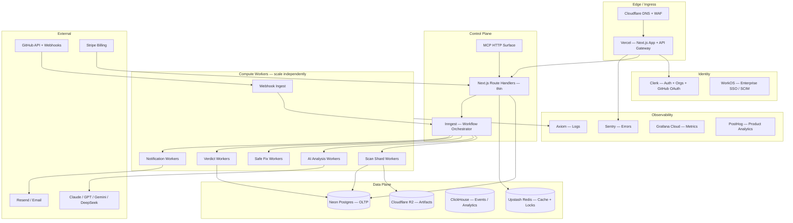
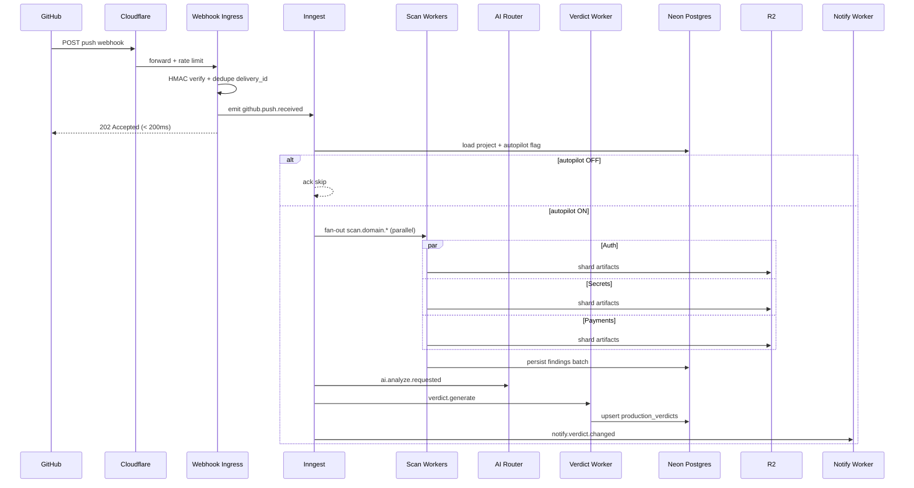
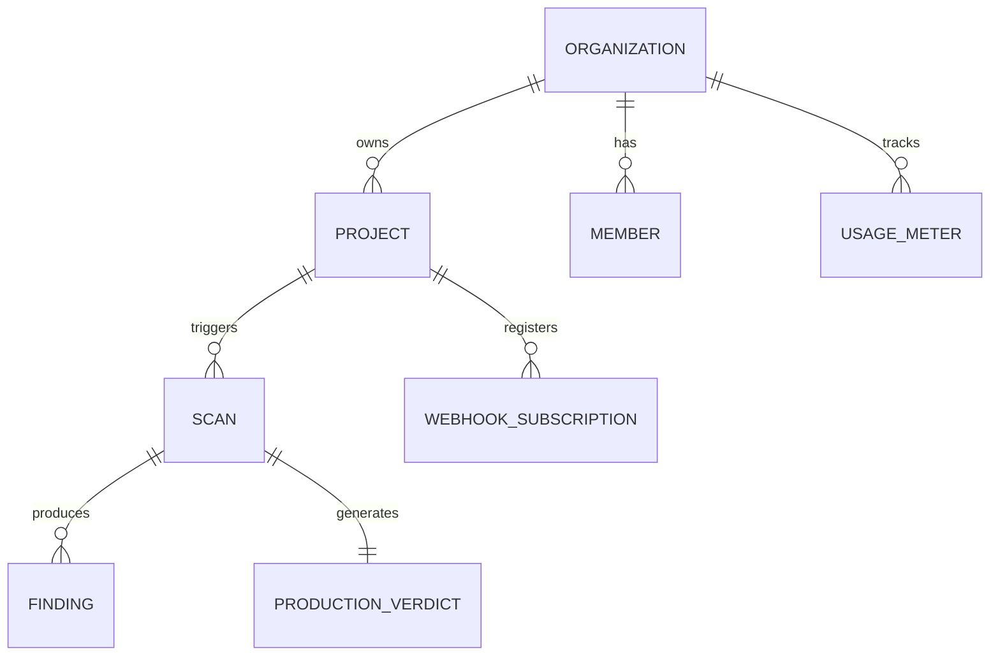
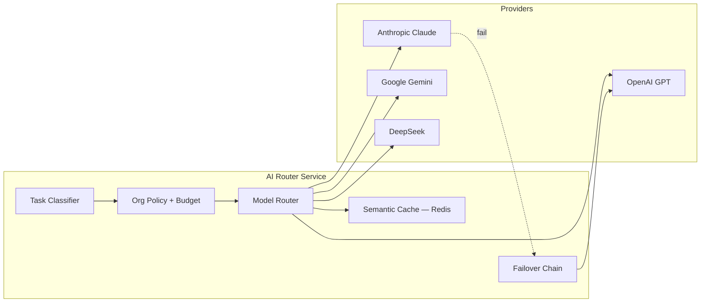
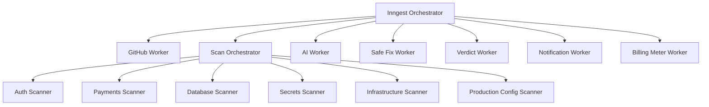

# SequrAI Target Architecture

**Version:** 1.0  
**Date:** 2026-07-23  
**Scale target:** 10,000+ active users today; 100,000+ without re-architecture  
**Design principle:** *Control plane on Vercel. Data plane off Vercel.*

---

## Vision

SequrAI becomes the **Stripe of Production Readiness** for AI-built software: every push gets a durable Production Review, a deterministic Production Verdict, optional Safe Fixes, and real-time notifications — at platform scale.

The architecture must be:

- Scalable · Reliable · Cost efficient · Production ready  
- Event driven · AI ready · Multi tenant · Enterprise ready  
- Serverless friendly · Fault tolerant  

---

## 1. Complete infrastructure architecture



### Layer responsibilities

| Layer | Technology | Role |
|---|---|---|
| Frontend | Next.js 16 on Vercel | Dashboard, onboarding, MCP HTTP, thin API gateway |
| Auth | Clerk (+ WorkOS enterprise) | Identity, orgs, SSO; sync `clerk_org_id` → Postgres |
| OLTP | Neon Postgres | Tenants, projects, scans, verdicts, billing state |
| Cache | Upstash Redis | GitHub cache, rate limits, locks, hot verdicts |
| Objects | Cloudflare R2 | Repo snapshots, scan bundles, AI traces (encrypted) |
| Analytics | ClickHouse | Webhook deliveries, scan metrics, AI cost, audit |
| Orchestration | Inngest | Event DAG: webhook → scan → AI → verdict → notify |
| Scan compute | Fly.io / Railway | Parallel domain scanners |
| AI | Router service | Multi-model, failover, cost optimization |
| Billing | Stripe | Plans + metered scans/tokens/repos |
| Security edge | Cloudflare | WAF, DDoS, optional webhook edge validation |

---

## 2. System diagram — Continuous Review flow



### Canonical pipeline

```
GitHub Webhook
  → ingest.validate (sync, <200ms)
  → github.event.received
  → review.scheduled (dedupe repo+commit)
  → scan.domain.* × N (parallel)
  → scan.aggregated
  → ai.analysis.requested
  → safefix.generate (optional)
  → verdict.generate
  → notify.dispatched
```

---

## 3. Database architecture

### Principle: one OLTP brain, specialized stores for scale



### Technology decisions

| Store | Decision | Rationale |
|---|---|---|
| **Neon Postgres** | ✅ Primary OLTP | Serverless Postgres, branching, read replicas, compatible with existing 19 migrations |
| **Supabase (hosted)** | ⚠️ Phase 0–1 only | Good for beta; connection limits and platform coupling at scale |
| **Upstash Redis** | ✅ Required | Idempotency, GitHub ETag cache, org rate limits, scan locks, hot verdict cache |
| **ClickHouse** | ✅ Analytics | Millions of webhook events, scan timings, AI token costs |
| **Cloudflare R2** | ✅ Artifacts | Repo trees, large payloads, SARIF; no egress fee to workers |
| **Turso** | ❌ | Edge SQLite — wrong for heavy multi-tenant joins |
| **PlanetScale** | ❌ | MySQL — incompatible with existing Postgres migrations |

### Multi-tenancy

- **Row-level:** every table has `organization_id`; enforce in app + Postgres RLS.
- **Enterprise:** dedicated Neon branch or isolated database per customer.
- **Sharding key (100K+):** `organization_id` → worker pool affinity.

### Hot vs cold data

| Data | Store | Retention |
|---|---|---|
| Active scan state | Postgres + Redis lock | hours |
| Latest verdict | Postgres + Redis cache | invalidate on new scan |
| Full findings | Postgres + R2 blobs | 90 days hot → archive |
| Webhook log | ClickHouse | 13 months |
| AI traces | R2 encrypted + CH metadata | 30–90 days |

---

## 4. Queue architecture

### Technology comparison

| System | Verdict | Notes |
|---|---|---|
| **Inngest** | ✅ **Primary** | Vercel-native, step functions, retries, concurrency keys, fan-out |
| Trigger.dev | ✅ Alternative | Similar durable workflows |
| Upstash QStash | ⚠️ Secondary | HTTP fan-out only; weak multi-step DAG |
| BullMQ | ⚠️ Inside workers | Long-lived Redis workers on Fly — not on Vercel |
| Cloudflare Queues | ⚠️ Optional at 100K | Raw webhook buffer at edge |
| SQS + Lambda | ❌ Early | AWS lock-in; slower iteration |

### Recommendation

**Inngest** orchestrates the product pipeline.  
**Upstash Redis** handles idempotency, cache, rate limits.  
**BullMQ** (optional) inside scan worker processes for domain-level parallelism.

### Concurrency and fairness

```
review.pipeline  → concurrency: 5 per org
scan.global      → concurrency: 500 platform-wide
github.api       → concurrency: 1 per installation
ai.org           → concurrency: 3 per org
```

**Priority:**

- P0: Manual review (user waiting in UI)
- P1: Continuous review on default branch
- P2: PR / non-production branches

---

## 5. AI architecture



### Task → model routing

| Task | Default | Fallback |
|---|---|---|
| Verdict summary | Claude Sonnet | GPT-4o |
| Safe Fix generation | Claude Sonnet | GPT-4o-mini |
| Bulk classification | Gemini Flash / DeepSeek | GPT-4o-mini |
| Critical secret analysis | Claude Opus (tier-gated) | Claude Sonnet |

### Router capabilities

- Failover across providers (max 3 attempts)
- Per-org daily token budget with model downgrade
- Parallel domain summaries → merge (map-reduce)
- Provider plugin registry for future models
- Redact secrets before any model call
- Store prompts/responses in R2; reference by `trace_id` in Postgres

**Important:** Production Verdict **scoring stays deterministic** (`brain/production-verdict/engine.ts`). AI enriches narrative only — ADR-001 alignment preserved.

---

## 6. Worker architecture

Workers deploy independently on **Fly.io / Railway** (Kubernetes optional at 200K+).



| Worker | Input | Output | Scale trigger |
|---|---|---|---|
| GitHub Worker | webhook, connect | repo snapshot | webhook QPS |
| Scan Orchestrator | `scan.start` | domain jobs | scan backlog |
| Domain scanners | `scan.domain.*` | finding shards | CPU per domain |
| AI Worker | `ai.analyze` | priorities, narrative | token rate |
| Safe Fix Worker | `safefix.generate` | patch proposals | AI queue |
| Verdict Worker | `verdict.generate` | Production Verdict v1 | correctness-critical |
| Notification Worker | `notify.*` | email, slack, in-app | delivery rate |
| Billing Worker | `usage.record` | Stripe meter events | every scan |

**Vercel must not run `InlineScanJobRunner`.** It only enqueues.

---

## 7. Cache strategy (Redis)

| Key pattern | Data | TTL | Invalidation |
|---|---|---|---|
| `verdict:project:{id}` | Latest verdict JSON | 5 min | on `verdict.generated` |
| `github:repo:{id}:meta` | Repo metadata | 1 h | repository webhook event |
| `github:api:{installation}:{path}` | ETag cache | 15 min | conditional GET |
| `scan:active:{repo_id}` | Active scan + lock | 30 min | scan complete/fail |
| `org:ratelimit:{id}:scans` | sliding window | 1 h | — |
| `ai:cache:{hash}` | deterministic AI response | 24 h | repo hash change |

Use **Redis SET NX** for scan locks alongside DB partial unique index.

---

## 8. Monitoring stack

| Concern | Tool |
|---|---|
| Logs | Axiom (or Datadog at enterprise) |
| Errors | Sentry |
| Metrics | Grafana Cloud |
| Traces | OpenTelemetry → Grafana Tempo |
| Product analytics | PostHog |
| Uptime | Better Stack |

### Golden SLIs

| SLI | Target |
|---|---|
| Webhook ack latency | < 200ms p99 |
| Time to Production Verdict | < 3 min p95 (medium repo) |
| Scan success rate | > 99.5% |
| AI failover success | > 99.9% |
| Notification delivery | > 99% within 5 min |

---

## 9. Auth: Clerk vs alternatives

| Option | Recommendation |
|---|---|
| **Clerk** | ✅ B2B SaaS UX, orgs, GitHub social — sync to Postgres |
| **Supabase Auth** | OK through Phase 1 if migration cost hurts |
| **WorkOS** | ✅ Enterprise SSO/SCIM at Phase 3+ |
| **Auth0** | Only if compliance mandates |

**Target:** Clerk for product auth + WorkOS for enterprise SSO. Postgres remains authorization source of truth.

---

## 10. Security recommendations

| Area | Requirement |
|---|---|
| Tenancy | RLS + app-layer checks; never trust client `orgId` |
| GitHub tokens | KMS envelope encryption; rotate keys |
| Webhooks | HMAC + replay window + `delivery_id` idempotency |
| AI | Secret redaction pre-prompt; no PII in logs |
| MCP / API | Scoped keys per workspace; rate limit + audit in ClickHouse |
| Enterprise | WorkOS SSO, SCIM, audit export, EU Neon branch |
| Compliance | SOC 2 path: Vercel, Clerk, Neon reports + controls |
| Secrets | Doppler / Vercel env; short-lived worker credentials |

---

## 11. Cost estimates (monthly, rough)

**Assumptions (10K users):** ~3 repos/user, ~5 pushes/repo/day → ~150K reviews/month.

| Component | 10K users | 100K users |
|---|---|---|
| Vercel | $400–800 | $2K–5K |
| Neon Postgres | $300–1K | $3K–8K |
| Upstash Redis | $100–300 | $800–2K |
| Inngest | $200–600 | $1.5K–4K |
| Scan workers (Fly) | $800–2K | $8K–20K |
| Cloudflare R2 | $50–200 | $500–2K |
| ClickHouse | $200–500 | $1.5K–4K |
| AI (blended) | $3K–15K | $30K–120K |
| Clerk | $500–1.5K | $5K–15K |
| Observability | $200–500 | $1K–3K |
| **Total** | **~$6K–22K/mo** | **~$55K–185K/mo** |

**Largest cost lever:** AI model routing and scan frequency (autopilot defaults, incremental scans).

---

## 12. Scaling strategy (100K without re-architecture)

| Dimension | Mechanism |
|---|---|
| Webhooks | Edge buffer → dedupe → Inngest |
| Scans | Horizontal worker replicas + domain parallelism |
| AI | Router pool + per-org concurrency |
| Postgres | Read replicas + PgBouncer |
| Hot tenants | Dedicated worker affinity + DB branch |

### Backpressure

1. Webhook returns 202 immediately  
2. Delay non-default-branch reviews when queue depth high  
3. Degrade: skip AI narrative, keep deterministic verdict  
4. Free tier: max N scans/day/org  

---

## 13. Production deployment

### Environments

| Env | Purpose |
|---|---|
| preview | PR previews, synthetic scans |
| staging | Full pipeline, test GitHub App org |
| production | Multi-region workers when EU > 20% customers |

### Deployment units

| Unit | Platform |
|---|---|
| `sequrai-app` (UI + thin API + Inngest serve) | Vercel |
| `sequrai-scan`, `sequrai-ai` | Fly.io |
| Postgres | Neon (prod + staging branches) |
| Artifacts | Cloudflare R2 per env |

### CI/CD

- Migrations: Neon branch → test → promote  
- Workers: deploy on tag; blue/green  
- Feature flags: LaunchDarkly or Postgres `org.features`  

---

## 14. Roadmap: 100 → 100,000+ users

| Phase | Users | Add | Cost band |
|---|---|---|---|
| 0 | 100 | Inngest shell, fix vercel.json, feature flags | $200–500/mo |
| 1 | 1K | Redis, full Inngest cutover, observability | $1.5K–4K/mo |
| 2 | 10K | Fly workers, R2, AI router, ClickHouse, Stripe meters | $6K–22K/mo |
| 3 | 50K | Multi-region, CF Queues buffer, Neon replicas | $25K–70K/mo |
| 4 | 100K+ | Clerk/WorkOS, tenant sharding, SOC 2 | $55K–185K/mo |

---

## References

- [Scaling Audit](./scaling-audit.md) — current state and gaps
- [Migration Plan](./migration-plan.md) — phased cutover and Block 1 file list
