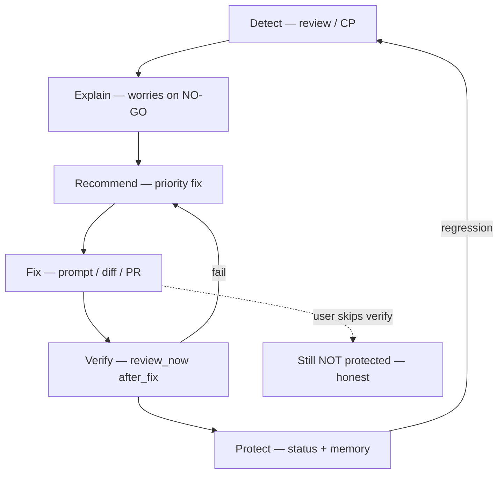

# End-to-End Pipeline Specification

**Purpose:** Single reference for **Detect → Explain → Recommend → Fix → Verify → Protect** across web and MCP.

See component docs [01](./01-safe-fix-specification.md)–[08](./08-mcp-auto-remediation-experience.md).

---

## Stage definitions

| Stage | Owner system | User-visible output |
|-------|--------------|---------------------|
| **Detect** | Layer 1 review + CP | Findings (internal); verdict deploy answer |
| **Explain** | Verdict formatter | Worries + why it matters |
| **Recommend** | Verdict + rec engine | Top fix + Safe Fix offer |
| **Fix** | Safe Fix / diff / approved PR | Prompt copy or PR URL |
| **Verify** | `review_now` | New verdict vs baseline |
| **Protect** | Status + Memory + alerts | PROTECTED narrative, `fix_verified` |

---

## Flow diagram

---

## Gates (mandatory approval)

| Transition | Gate |
|------------|------|
| R → F (PR) | Approve + confirm dialog |
| F → V | User initiates review |
| V → P | Objective clearance rules |
| Any → production deploy | **Not SequrAI** |

---

## Parallel paths

| Path | Skips |
|------|-------|
| Prompt-only fix | Diff, PR |
| Diff local apply | PR |
| Dismiss recommendation | F, V until new review |

---

## Acceptance

Full pipeline exercisable in user test script: NO-GO → copy fix → review again → GO → protected copy.
