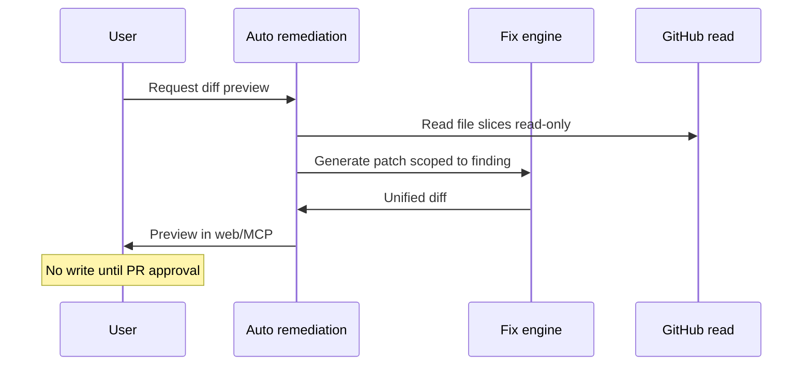

# Diff Generation Specification

**Purpose:** Show **what would change** before any GitHub write — trust layer between Recommend and Fix.

**Pipeline stage:** **Fix** (preview only until user approves PR path).

---

## Sources

- Fix engine / brain path (existing production fix prompt → patch generation).  
- Input: finding evidence (file path, line range, rule id), **not** full repo snapshot in Memory.

---

## Output format

| Field | Stored in Memory? |
|-------|-------------------|
| Unified diff (text) | **No** — ephemeral in session / short TTL store |
| Diff hash | Optional fingerprint on recommendation |
| Files touched count | Yes in payload summary |
| Lines added/removed | Yes (counts only) |

**Never store** full diff in `protection_events` long-term — size + secret leakage risk.

---

## Scope limits (V1)

| Limit | Value | Rationale |
|-------|-------|-----------|
| Max files per fix | **3** | Prevent repo rewrite |
| Max lines changed | **200** | Reviewable PR |
| Allowed file types | Source + config in allowlist | No lockfile mass regen without explicit dep fix type |
| Forbidden | `.env`, secrets, credentials paths | Block generation + explain |

If scope exceeded:

> *This fix is too large for Safe Fix PR — use the Cursor prompt and apply manually.*

---

## Generation workflow

---

## Quality gates

| Check | Fail behavior |
|-------|---------------|
| Diff empty | Fall back to prompt-only |
| Syntax invalid (heuristic) | Lower confidence; warn user |
| Touches forbidden path | Block diff; prompt-only |
| Same as default branch | Idempotent “already fixed?” message |

---

## Presentation

### Web

- Side-by-side or unified diff viewer  
- Summary header: *{n} files, +{a}/−{b} lines*  
- CTA: **Approve and open PR** (doc 04) — not “Apply”

### MCP

- Truncate diff in chat; link **Open full preview in Protection Center**  
- Never dump 200 lines without user asking

---

## Relationship to Safe Fix prompt

| Path | When |
|------|------|
| Prompt-only | Default; diff optional |
| Diff without PR | User wants to apply locally |
| Diff → PR | User approves after preview |

Prompt and diff must **describe the same fix** — same `recommendationId`.

---

## Idempotency

Key: `{orgId}:{projectId}:{findingStableId}:diff_v1`

Regenerate invalidates prior diff hash on new scan only.

---

## Acceptance criteria

- 100% of diffs respect file/line caps or fail gracefully.  
- No diff persisted in Memory append-only log.  
- Preview available before any PR approval click.
