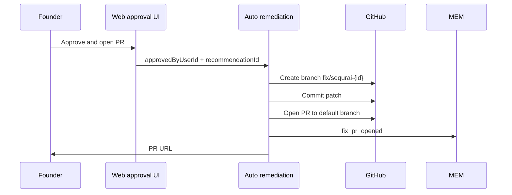

# PR Generation Specification

**Purpose:** Open a **GitHub pull request** from an approved patch — still **no merge, no deploy** without the user.

**Pipeline stage:** **Fix** (after approval — doc 04).

---

## Preconditions

| Requirement | |
|-------------|--|
| GitHub App installed with **contents write** + pull requests | |
| User clicked **Approve and open PR** | Mandatory |
| Diff preview shown (or explicit waive for prompt-only PR path — discouraged) | |
| Idempotency: no open PR for same `findingStableId` | |

---

## PR flow



---

## PR metadata

| Field | Convention |
|-------|------------|
| Title | `[SequrAI Safe Fix] {plain title}` |
| Body | What / why / verify steps + link to Protection Center |
| Branch | `sequrai/safe-fix-{shortId}` |
| Labels | Optional `sequrai-safe-fix` |
| Reviewers | None auto-added |
| Assignees | None |

**Never:** auto-merge, auto-approve, bypass branch protection.

---

## User responsibilities (copy in PR body)

```
This PR was opened because you approved it in SequrAI.
SequrAI did not merge or deploy this change.

Next steps:
1. Review the diff like any other PR.
2. Merge when you're satisfied.
3. Ask SequrAI to review again in Cursor.
```

---

## Failure handling

| Failure | Behavior |
|---------|----------|
| GitHub API error | Retry once; show error; no duplicate PR (idempotency) |
| Branch exists | Reuse or fail with link to existing PR |
| Permission denied | Explain missing scopes; offer prompt-only |
| Default branch protected | PR still OK — user merges via normal process |

Memory: optional `fix_pr_failed` event (ops); user sees actionable message.

---

## MCP boundary

MCP **does not** create PRs directly in V1 if OAuth/host cannot approve.

**Pattern:**

1. `safe_fix` → prompt + link  
2. *“Open PR on web”* → deep link to approval screen with `recommendationId`

Future: MCP-hosted approval only if same audit trail as web (architecture doc 09).

---

## Memory

| Event | When |
|-------|------|
| `fix_pr_opened` | PR created |
| Recommendation status | `applied` (pending verify) |

---

## Non-goals

- PRs without user approval click  
- PRs to production branch bypassing review  
- Batch mega-PR fixing 10 findings  

---

## Acceptance criteria

- Zero PRs created without `approvedAt` + `approvedByUserId`.  
- Zero duplicate open PRs per finding (integration test).  
- PR body passes “no autonomous merge” lint.
