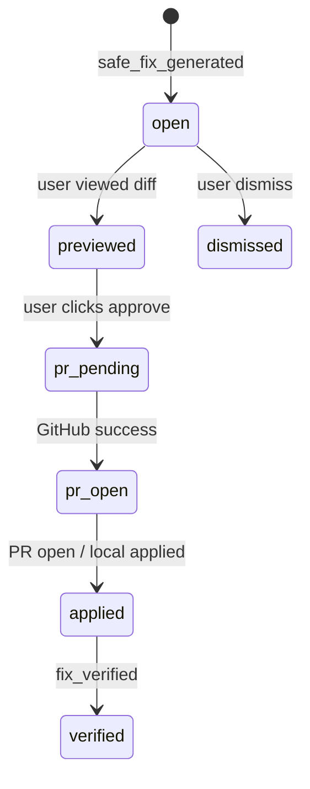

# Approval Workflows Specification

**Purpose:** Explicit **human gates** at every step that could change code or imply production readiness.

**Principle:** Viewing is free; **writing requires confirm.**

---

## Approval matrix

| Action | Approval required | Surface | Audit fields |
|--------|-------------------|---------|--------------|
| View Safe Fix prompt | No | Web, MCP | — |
| Copy fix for Cursor | No | Web | optional analytics |
| View diff preview | No | Web, MCP link | — |
| **Open GitHub PR** | **Yes — click + confirm dialog** | Web (V1 primary) | `approvedByUserId`, `approvedAt` |
| Dismiss recommendation | Soft confirm | Web | `dismissedReasonPlain` |
| Mark “I applied locally” | Optional checkbox before verify | Web | `appliedAt` |
| Merge PR | **User in GitHub** — not SequrAI | GitHub | — |
| Deploy to production | **User infra** — not SequrAI | — | — |

---

## PR approval dialog (required copy)

```
Open a pull request with this fix?

SequrAI will create a branch and PR on GitHub.
You still review and merge the PR yourself.
SequrAI will not merge or deploy.

[ Cancel ]  [ Approve and open PR ]
```

Checkbox optional (V1.1): *I understand I must review the diff.*

---

## Who can approve

| Rule | V1 |
|------|-----|
| Org member with project access | Yes |
| MCP session user | Must match org; PR still via web if no write token |
| Service account | **Never** approves on behalf of user |

---

## Workflow states (recommendation)



`previewed` optional — not required before PR if user accepts dialog.

---

## Dismiss workflow

1. User clicks *Not now*  
2. Optional reason: *Won't fix / false positive / fix manually*  
3. Memory: `recommendation_dismissed`  
4. Finding may reappear on next review → new recommendation allowed  

**No** dismiss from MCP without equivalent web/settings path in V1 (MCP explains).

---

## Approval vs protection status

Approval to open PR **does not** change PROTECTED status until **Verify** (doc 05).

Copy after approval:

> *PR opened — you're not protected until we verify after merge.*

---

## Compliance narrative

For investors / trust center (future):

> *SequrAI never changes production. All code changes require explicit user approval and normal GitHub review.*

---

## Acceptance criteria

- PR API rejects requests without approval audit fields.  
- Confirm dialog shown 100% of PR creation attempts from UI.  
- No background job opens PRs on schedule.
