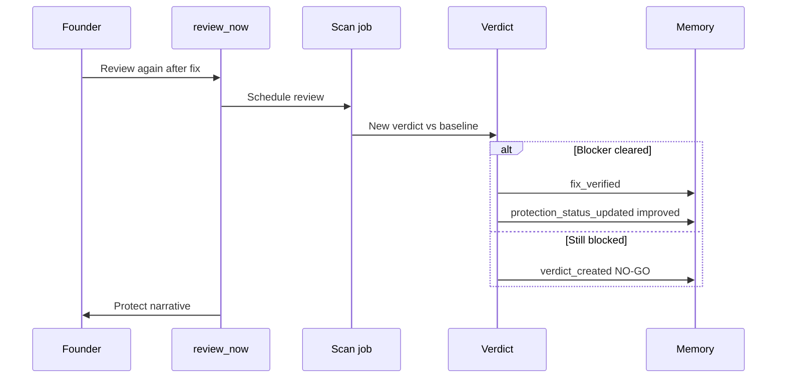

# Verification Workflows Specification

**Purpose:** Close the loop — prove the fix worked and **restore protection** narrative.

**Pipeline stages:** **Verify → Protect**

---

## When verification runs

| Trigger | Who |
|---------|-----|
| User: **Check again** / **Review again** | Web or MCP `review_now` |
| Suggested after merge | PR body + MCP follow-up copy |
| **Not** automatic on PR open | — |
| **Not** automatic on PR merge without user ask | V1 — optional webhook architecture only |

Parameter: `review_now` reason = `after_fix` + optional `recommendationId`.

---

## Verification workflow



---

## Baseline comparison

Compare new verdict to **pre-fix snapshot**:

| Signal | Source |
|--------|--------|
| Primary blocker cleared | finding absent or severity below threshold |
| Production confidence delta | snapshot diff |
| Deploy answer | GO / NOT YET / NO-GO |
| Same worry in top 3 | partial success copy |

---

## Outcomes & copy

### Success (`fix_verified`)

```
You're in better shape.

{Blocker title} is resolved.
Production confidence: {before}% → {after}%
Deploy answer: {GO|NOT YET}

What worries me now:
• {remaining or "Nothing urgent"}

Recommendation:
{next open fix OR keep building}
```

Auto-resolve linked alerts (security-alerts doc 05).

### Partial

```
Good progress — {blocker} improved, but I still wouldn't deploy yet because of {x}.
Apply Safe Fix for {x}, then review again.
```

### Failure (fix ineffective)

```
Honest answer: the change didn't clear what worried me.

What I still see:
• {finding plain title}

I'd review the diff manually or try a different approach.
```

No false “protected” claim.

---

## Protect stage

After verify success:

| System | Update |
|--------|--------|
| Protection status | Recompute (may → PROTECTED) |
| Recommendations | `verified` |
| Memory | `fix_verified`, timeline episode |
| Alerts | Resolve linked Urgent/Important |
| Reports | “What improved” next weekly/monthly |

MCP: user may ask *Am I protected?* → `can_i_deploy`.

---

## Metrics

| Metric | Target (bible) |
|--------|------------------|
| PR opened → verify within 14d | ≥ 50% |
| safe_fix → review_now within 7d | ≥ 25% (MCP metrics) |

---

## Multiple fixes

Verify is **whole-project review**, not single-finding unit test.

One `fix_verified` per recommendation cleared; multiple may fire in one review.

---

## Acceptance criteria

- `review_now` after_fix always writes new verdict + comparison in Memory.  
- `fix_verified` only when objective clearance rules pass.  
- MCP Protect message matches Protection Center status same snapshot.
