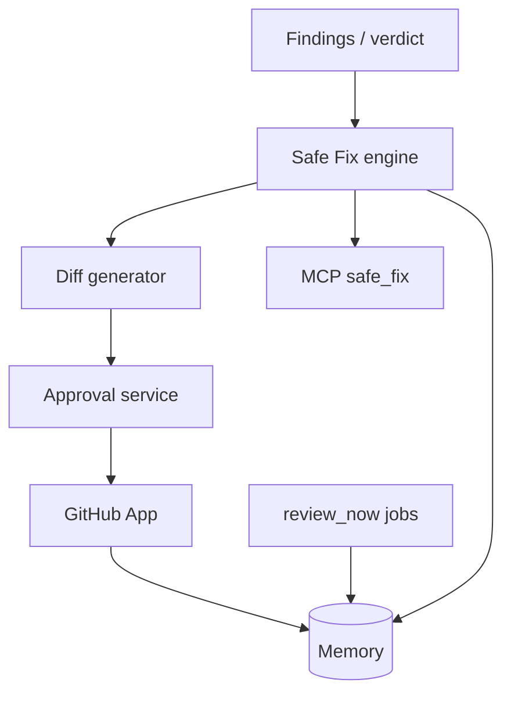

# Future Architecture Specification

**Purpose:** Extension points beyond Hybrid V1 — **without** breaking the no-autonomous-production rule unless explicitly promoted via bible amendment.

---

## V1 architecture (ships)

**Trust boundary:** GitHub write only inside **Approval service** after user confirm.

---

## Extension points (architecture only)

| Extension | Description |
|-----------|-------------|
| MCP-hosted PR approval | OAuth + same audit as web |
| Post-merge webhook → suggest verify | **Suggest only** — no auto review |
| Fix templates per stack | Stripe, Supabase, Next.js packs |
| Multi-finding batch PR | User selects findings — scope cap still applies |
| CI status check | NO-GO blocks merge until verify GO — doc 03 hybrid scope ARCH |
| Ephemeral diff store | S3 with TTL 24h |

---

## Data & idempotency

| Key space | Purpose |
|-----------|---------|
| `fix_v1`, `diff_v1` | Prompt/diff dedupe |
| `pr_v1` | One open PR per finding |
| `verify_v1` | Tie review to recommendation |

Outbox for failed GitHub writes (retry) — postgres pattern from technical doc 09.

---

## Security

- Read-only GitHub for prompt-only orgs  
- Write scope requested only at PR connect  
- Patch content scanned for secret patterns before PR create — block if detected  
- RLS on recommendations + approval audit rows  

---

## Scale

| Scale | Note |
|-------|------|
| 1k orgs | Serial PR creates OK |
| 10k | Rate limit GitHub App; queue PR jobs |
| Fix engine cost | Cap AI tokens per fix via file scope |

---

## Observability

Product metrics (not ops):

- safe_fix_generated count  
- PR approval → open latency  
- verify success rate  
- rollback rate post-verify  

Ops alerts remain separate (`ops-alerts`).

---

## Dependencies

- Layer 1 findings  
- Production Memory recommendations  
- GitHub App  
- MCP formatters  

See [10-ships-now-vs-backlog.md](./10-ships-now-vs-backlog.md).
