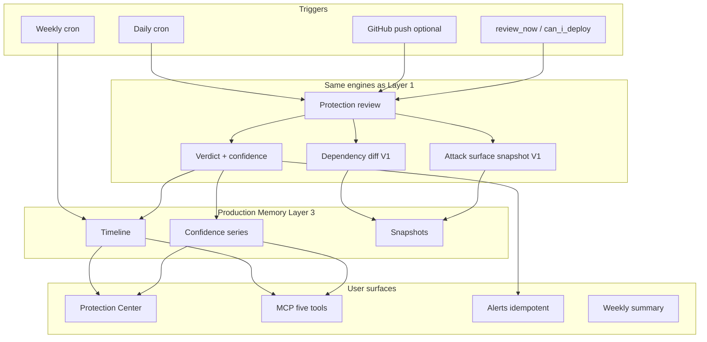

# Continuous Protection Specification

**Status:** Design — documentation only.  
**Effective with:** Hybrid V1 Product Bible (Layer 2).

---

## What we are selling

**Continuous Protection** is the feeling:

> *My application is protected even when I am not thinking about it.*

We are **not** selling:

- Point-in-time scans
- CVE lists or security scores as the product
- “Run a review when you remember”

We **are** selling:

- Always-on re-evaluation against the same Production Verdict engines
- Diffs vs **Production Memory** (what changed, is confidence drifting?)
- Rule-based **behaviour signals** (no ML in V1)
- Calm alerts only when something **material** changes
- One place (Protection Center + MCP) that answers **Am I protected?**

---

## Protection never stops

| Phase | What SequrAI does | User feels |
|-------|-------------------|------------|
| Before deploy | Verdict + Safe Fix (Layer 1) | “I know if I can ship.” |
| During development | Push correlation + optional auto-review | “My changes are watched.” |
| After deploy | Daily check vs last known good | “Production drift is caught.” |
| In production | Memory + weekly proof + health trend | “Someone senior is watching.” |
| Continuously | CP ON by default | “I don’t have to ask.” |

---

## Core architecture (conceptual)

**Invariant:** Scheduled jobs **write Memory**; MCP **never** runs hidden scans. User questions map to existing tools reading latest state (see doc 09).

---

## The six founder questions

| Question | Primary data | Primary surfaces |
|----------|--------------|------------------|
| Is my application protected? | Protection status (doc 04) + CP ON + recency | Protection Center, `can_i_deploy` framing |
| Is it becoming less secure? | Confidence trend + behaviour rules | `production_history`, weekly summary |
| Has anything changed since yesterday? | Daily check diff + Memory | `what_changed`, daily alert if material |
| Should I worry about something? | Top worries + status | `can_i_deploy`, Protection Center |
| Is production confidence ↑ or ↓? | Confidence history | Protection Center sparkline, `production_history` |
| What should I fix next? | Single recommendation | Safe Fix CTA, `safe_fix` |

---

## Cadence overview

| Cadence | Spec | User-visible default |
|---------|------|----------------------|
| Daily | [02-daily-protection-review-specification.md](./02-daily-protection-review-specification.md) | **Silent** unless material change |
| Weekly | [03-weekly-protection-review-specification.md](./03-weekly-protection-review-specification.md) | In-app summary; email optional |
| Monthly | Product Bible doc 06 | Protection Report (email + archive) — out of this sprint’s 10 docs but referenced in Hybrid V1 |
| On demand | Layer 1 + MCP | `review_now`, `can_i_deploy` |

---

## Attack surface evolution V1

**Scope:** Static comparison between review snapshots — **not** live attack detection.

### What we compare

- Public routes / API handlers (framework-aware static extraction)
- Auth middleware presence or changes
- New webhooks, OAuth callbacks, public admin paths
- Secrets **patterns** in diff (blocker event; no secret values stored)

### Outputs

| Signal | Memory event | User sees |
|--------|--------------|-----------|
| Level unchanged | `attack_surface_snapshot` | Weekly / Protection Center footnote only if worries |
| Level increased (e.g. LOW → MED) | `material_change_detected` | Alert + status → REQUIRES ATTENTION or SAFE WITH CAUTION |
| Level decreased | `attack_surface_snapshot` | Positive line in weekly: “Attack surface reduced.” |

### Confidence impact

Attack surface level feeds **worries** and can cap deploy framing:

- HIGH → unlikely **PROTECTED**; deploy answer leans NOT YET / NO until mitigated.

### Explicit non-goals

- Crawling production URLs in real time
- WAF / CDN telemetry
- “Someone is attacking you now”

---

## Material vs non-material change

**Material** (notify user):

- New critical or high severity finding
- Security or production confidence drop ≥ **10 points** in 24h (aligns behaviour rule BD-01)
- Attack surface level increases
- New **critical** dependency advisory affecting the project (doc 06)
- Protection paused while previously PROTECTED

**Non-material** (Memory only):

- Medium/low finding churn with stable confidence
- Copy or comment-only commits with no model change
- Dependency patch with no new critical advisory

Target: **&lt; 5%** of daily checks generate an alert (bible success metric).

---

## Default ON

When:

- GitHub connected
- First successful protection review completed

Then:

- Daily check scheduled
- Confidence snapshot daily
- Weekly summary eligible

User may pause with explicit risk copy (status → NOT PROTECTED for “watching” semantics — doc 04).

---

## Integration map

| Component | Spec |
|-----------|------|
| Daily job | Doc 02 |
| Weekly job | Doc 03 |
| Four protection states | Doc 04 |
| Health scores | Doc 05 |
| Dependencies | Doc 06 |
| Rules | Doc 07 |
| Dashboard | Doc 08 |
| MCP | Doc 09 |
| Ship vs backlog | Doc 10 |

---

## Copy principles (all CP surfaces)

**Say:** protected, worries me, confidence, safe with caution, fix first, peace of mind.  
**Avoid:** CVE, CVSS, scanner, posture score, “3 vulnerabilities.”

---

## Success criteria (layer)

| Metric | Hybrid V1 target |
|--------|------------------|
| Active projects with CP ON | ≥ 80% |
| Alert noise (alerts / daily checks) | &lt; 5% |
| Founders describe product as “always protecting” | Qualitative beta interviews |
| MCP “Am I protected?” answered without tool jargon | Intent eval + conversation tests |

---

## Final recommendation test

After Hybrid V1 ships this layer:

> *I don't even think about cybersecurity anymore because SequrAI is continuously protecting my application.*

**Design intent:** **YES** — if daily silence, weekly proof, status clarity, and MCP framing match docs 04–09.
