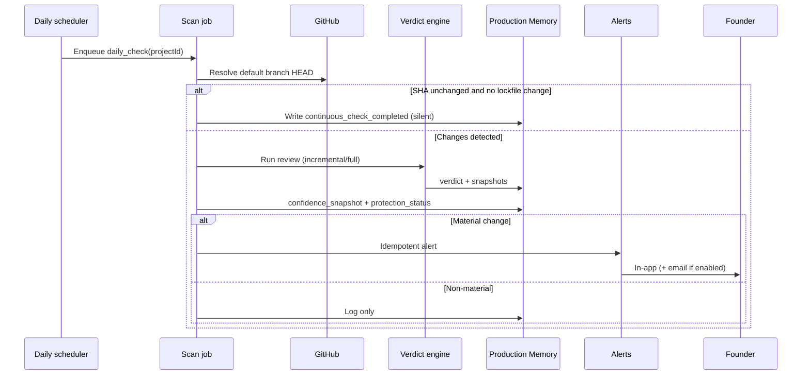

# Daily Protection Review Specification

**Purpose:** Lightweight, scheduled re-evaluation so protection **never stops** — with **silent success** as the default experience.

---

## What happens every day

Each connected project with **Continuous Protection ON** receives one **Daily Protection Review** per calendar day (org timezone, default UTC).

The daily review is **not** a separate product the user runs. It is SequrAI working while the founder builds.

### Included checks (single job pipeline)

| Check | Description | Engine |
|-------|-------------|--------|
| **Production review** | Deploy hygiene, env patterns, config footguns | Verdict domains |
| **Security review** | Findings vs last snapshot | Verdict / findings diff |
| **Project health review** | Composite health label update | Doc 05 |
| **Dependency review** | Lockfile diff + critical advisories | Doc 06 |
| **Confidence review** | Snapshot production + security confidence | Memory |
| **Protection status update** | Recompute PROTECTED / SAFE WITH CAUTION / etc. | Doc 04 |
| **Attack surface review** | Static snapshot diff | Doc 01 |

**Cost guardrail:** If default-branch SHA unchanged since last full review and no lockfile change, run **incremental diff-only path** (dependency + attack surface + confidence recompute from cached verdict). If SHA changed or lockfile changed, run **incremental or full review** per job budget (same as bible).

---

## Workflow



---

## Triggers

| Trigger | Id | When |
|---------|-----|------|
| Scheduled daily | `cp.daily.cron` | Once per project per day, staggered by project id hash |
| Catch-up | `cp.daily.missed` | If prior day failed, retry once before next cron |
| Manual override | — | **Not** a separate user button; user uses `review_now` instead |

**Does not trigger daily job:** User asking “Am I protected?” in MCP (read-only).

Optional Hybrid V1: **push webhook** may enqueue an **on-push review** (Layer 1) which **updates the same Memory fields** as daily; daily job still runs for “nothing pushed” peace of mind.

---

## Memory events

| Event type | When |
|------------|------|
| `continuous_check_completed` | Daily success, no material change |
| `material_change_detected` | Any material rule fired |
| `confidence_snapshot` | Every completed daily path |
| `attack_surface_snapshot` | When static model recomputed |
| `dependency_snapshot` | When lockfile processed |
| `protection_status_updated` | Status label changed |

Payload (sanitized): `{ previousStatus, newStatus, sha, worriesTop3[], recommendationId?, confidence: { production, security } }`.

---

## User experience

### Default (95%+ of days)

**Nothing in inbox.** No email.

Optional subtle indicator on Protection Center:

- “Last checked: today”
- Status unchanged: **PROTECTED** (or current state)

Copy:

> *SequrAI checked your application today. Nothing material changed.*

### Material change day

**In-app alert** (required):

```
Something changed in your application.

Your protection status is now: REQUIRES ATTENTION.

What worries me most:
• {worry 1}
• {worry 2}

Recommended action:
Apply Safe Fix for {primary blocker}.
```

**Email** (if alerts ON): same structure, one primary CTA → project Protection Center.

**Never:** raw CVE table in alert body.

---

## MCP experience

Daily jobs **do not** expose a tool. The user asks naturally:

| User | Tool | Behaviour |
|------|------|-----------|
| Am I protected? | `can_i_deploy` | Read latest status + worries; mention last check time |
| What changed since yesterday? | `what_changed` | Diff last two meaningful memory snapshots |
| Should I worry? | `can_i_deploy` | Opinion + top worries |
| Review again | `review_now` | Fresh scan; does not replace schedule |

If daily check is **stale** (&gt; 36h) while CP ON, MCP adds:

> *I have not finished today's scheduled check yet — here's the latest I trust.*

---

## Failure modes

| Failure | User sees | System |
|---------|-----------|--------|
| Job failed | No false “PROTECTED”; status may show **REQUIRES ATTENTION** with “check delayed” | Retry + ops alert |
| GitHub disconnected | **NOT PROTECTED** + reconnect CTA | Pause daily enqueue |
| CP paused | **NOT PROTECTED** (user choice) | No cron |

---

## Acceptance criteria (Hybrid V1)

- Daily job completes for 99% of eligible projects within 24h window.
- Material alerts are idempotent (same finding same day → one alert).
- Silent days produce **zero** email when email alerts enabled.
- Protection status after daily run matches doc 04 rules deterministically.
