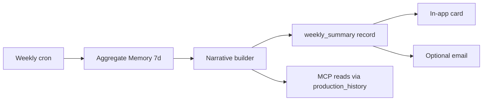

# Weekly Protection Review Specification

**Purpose:** A **readable proof** that SequrAI watched the app all week — trends, changes, and **one** recommendation. Not a PDF dump of findings.

---

## What happens every week

Once per project (same timezone as daily), SequrAI produces a **Weekly Protection Review**:

1. **Protection summary** — status + narrative
2. **Changes detected** — vs start of week (Memory)
3. **Confidence changes** — production + security delta
4. **Attack surface evolution** — increased / reduced / stable
5. **Dependency changes** — new packages, new critical advisories
6. **Behaviour highlights** — fired rules (doc 07)
7. **Single recommendation** — usually Safe Fix

---

## Workflow



**No new scan required** if daily checks ran; weekly job is primarily **aggregation + narrative**. If zero daily completions in 7 days, enqueue **one** catch-up review before aggregating.

---

## Triggers

| Trigger | When |
|---------|------|
| `cp.weekly.cron` | Fixed weekday (recommend **Monday 08:00** user-local) |
| First CP week | End of first 7 days after first successful review |

---

## Report structure (in-app)

**Title:** `Your week with SequrAI`  
**Read time target:** &lt; 2 minutes

```
YOUR APPLICATION IS:
{PROTECTED | SAFE WITH CAUTION | REQUIRES ATTENTION | NOT PROTECTED}

This week at a glance
• Production confidence: {start}% → {end}% ({↑|↓|→})
• Security confidence: {start}% → {end}% ({↑|↓|→})
• Protection checks completed: {n}/7

What changed
• {bullet — plain language, max 5}

Attack surface
• {Stable | Increased to MED | Reduced}

Dependencies
• {None material | New critical advisory on {pkg} — affects confidence}

Things that worry me (still)
• {max 3}

One thing to do next
• {Recommendation — Apply Safe Fix | Review again | Reconnect GitHub}
```

---

## Email (optional, default OFF in beta; ON for paid default per bible)

- Subject: `SequrAI — Your app this week ({Project name})`
- Body: same sections as in-app; **no attachments** in V1 (HTML only).
- Unsubscribe: per-channel in Settings.

---

## Relationship to monthly report

| | Weekly | Monthly |
|---|--------|---------|
| Audience | Active founder | Founder + stakeholders |
| Depth | Trend + delta | Full Protection Report template (bible doc 06) |
| Metrics | 7-day | 30-day + “prevented” counters |

Weekly **feeds** monthly aggregation; do not duplicate monthly PDF in weekly email.

---

## User experience

### In-app

- **Protection Center:** pinned “This week” card at top when unread; dismiss marks read.
- **Home (portfolio):** dot badge if any project weekly unread + REQUIRES ATTENTION.

### Empty / quiet week

Copy:

> *Quiet week — confidence held steady and nothing material changed. You're still {PROTECTED}.*

Still show confidence sparkline (even flat).

---

## MCP experience

| User phrase | Tool | Response shape |
|-------------|------|----------------|
| How was my week? | `production_history` | 7-day narrative |
| Is my app getting less secure? | `production_history` + `can_i_deploy` | Trend + current status |
| What changed this week? | `what_changed` | Wider window in narrative |
| Summarize protection | `production_history` | Weekly card content as text |

---

## Acceptance criteria (Hybrid V1)

- Delivered within 1h of weekly cron for 99% of CP-ON projects.
- Confidence deltas match Memory snapshots (no hand-waved numbers).
- Exactly **one** primary recommendation per week.
- Weekly email passes copy lint (no “CVE”, no score-only hero).
