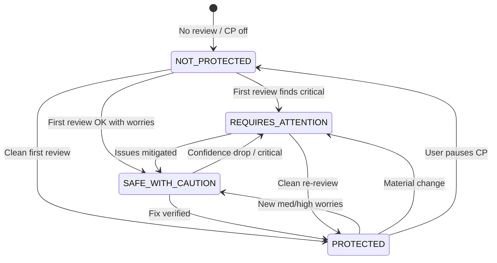

# Protection Status Specification

**Purpose:** One **human** status line — the first thing a founder sees. Not a scanner grade.

---

## The four states

| Status | Meaning (internal) | User-facing headline |
|--------|--------------------|----------------------|
| **PROTECTED** | CP ON, fresh review, no blocking issues, confidence above floor | **Your application is protected.** |
| **SAFE WITH CAUTION** | CP ON, deploy may be possible but material worries remain | **Protected, but I'm watching a few things.** |
| **REQUIRES ATTENTION** | Material change, stale watch, or confidence/rule triggers | **Something needs your attention.** |
| **NOT PROTECTED** | CP off, not connected, never reviewed, or critical blockers | **Your application is not protected yet.** |

---

## Decision logic (V1)

Evaluate in order; **first match wins** unless noted.

### NOT PROTECTED

- Continuous Protection **OFF** (user paused) → show pause reason
- No GitHub connection
- No successful protection review ever
- Latest deploy answer is **NO** with **critical** open blocker unresolved &gt; 24h
- Daily/weekly job failed **3 consecutive days** (watchdog)

### REQUIRES ATTENTION

- Material change in last **7 days** (doc 01) and not yet verified by `review_now` after fix
- Production or security confidence dropped **≥ 10 points** in 7 days
- Attack surface level **increased** since last week
- New **critical** dependency advisory (doc 06)
- Behaviour rules BD-01, BD-03, BD-04 fired (doc 07)
- Last successful check **&gt; 7 days** ago while CP ON (stale)

### SAFE WITH CAUTION

- CP ON, check within 7 days
- Deploy framing **NOT YET** or worries include **high** (not critical) items
- Attack surface **MED** with no increase this week
- Confidence stable but below “high confidence” band (e.g. production &lt; 85%)

### PROTECTED

- CP ON, check within **7 days**
- No unresolved **critical** findings
- Deploy answer **GO** or **NOT YET** with only low/med worries
- Attack surface **LOW** or stable **MED** with mitigations noted
- No active REQUIRES ATTENTION triggers

**Note:** **GO** deploy and **PROTECTED** are aligned but not identical — user can be PROTECTED with NOT YET deploy if business chooses to ship with caution; UI copy must not contradict MCP deploy answer.

---

## State diagram



---

## What the user sees (Protection Center)

### PROTECTED

```
YOUR APPLICATION IS:
PROTECTED

Last checked: {relative time}
Production confidence: {n}%
Security confidence: {n}%

Things that worry me:
• {optional — max 1 mild worry or “Nothing urgent.”}

Recommendation:
{Keep building | optional polish Safe Fix}
```

### SAFE WITH CAUTION

```
YOUR APPLICATION IS:
SAFE WITH CAUTION

I'm protecting this app, but I'd fix these before your next deploy:
• {worry 1}
• {worry 2}

Recommendation:
Apply Safe Fix.
```

### REQUIRES ATTENTION

```
YOUR APPLICATION IS:
REQUIRES ATTENTION

What changed:
• {one line}

What worries me most:
• {worry 1}

Recommendation:
Review again after you apply Safe Fix.
```

### NOT PROTECTED

```
YOUR APPLICATION IS:
NOT PROTECTED

Why:
• {CP paused | Connect GitHub | Run first protection review}

Recommendation:
{Turn protection on | Connect GitHub | Protect my application in Cursor}
```

---

## Next actions by state

| Status | Primary CTA | Secondary |
|--------|-------------|-----------|
| PROTECTED | Open in Cursor (ask SequrAI) | View weekly summary |
| SAFE WITH CAUTION | Apply Safe Fix | Can I deploy? (MCP) |
| REQUIRES ATTENTION | Apply Safe Fix + Review again | View what changed |
| NOT PROTECTED | Enable CP / Connect GitHub / First review | MCP setup help |

---

## MCP mapping

All status reads go through **`can_i_deploy`** composite framing (no sixth tool):

| Status | MCP lead line example |
|--------|------------------------|
| PROTECTED | *Yes — I'm comfortable protecting this application in production.* |
| SAFE WITH CAUTION | *You're protected with caution. Here's what I'd fix before deploy.* |
| REQUIRES ATTENTION | *I'm not comfortable with the latest changes until we fix this.* |
| NOT PROTECTED | *I'm not protecting this repo yet — here's what we need.* |

Include **Deployment confidence** footer only when user asked deploy-adjacent question.

---

## Portfolio (multi-project)

Row badge maps 1:1 to four states — **not** READY/NOT YET alone:

| Status | Badge color semantics |
|--------|------------------------|
| PROTECTED | calm green |
| SAFE WITH CAUTION | amber |
| REQUIRES ATTENTION | strong amber |
| NOT PROTECTED | neutral + action |

Sort order: REQUIRES ATTENTION → NOT PROTECTED → SAFE WITH CAUTION → PROTECTED.

---

## Acceptance criteria

- Status deterministic from Memory + latest verdict (test fixtures per state).
- Status changes emit `protection_status_updated` and at most **one** alert per transition per day.
- Copy never shows numeric “security score” as hero — confidence % is secondary to status label.
