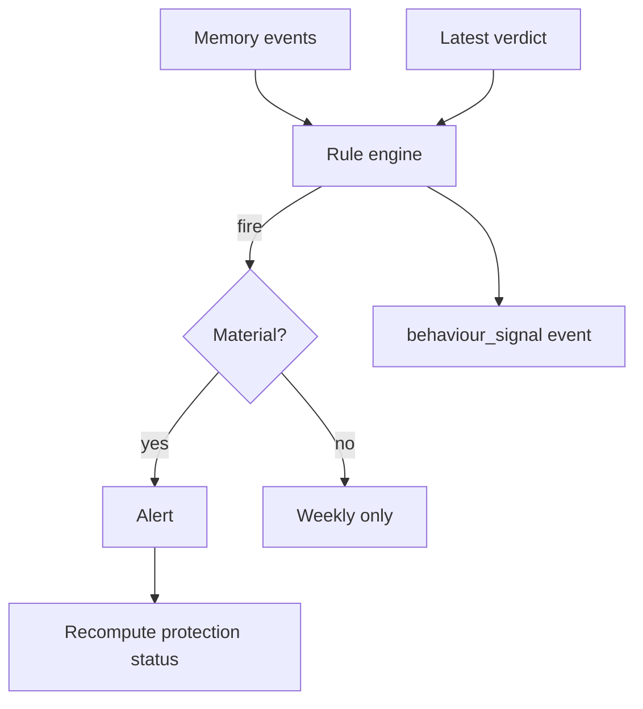

# Behaviour Detection V1 Specification

**Purpose:** Rule-based signals that the **project is behaving unlike itself** — without ML, without runtime traffic, without “attack in progress.”

**Companion:** Attack surface **evolution** is static diff (doc 01). Behaviour rules consume **Memory + verdict trends**, not packets.

---

## Principles

1. **Documented rules** — each rule has ID, condition, action, test fixture.
2. **Explain in founder language** — “confidence dropped sharply,” not “anomaly score 0.87.”
3. **Low noise** — weekly digest for slow burns; immediate alert only for sharp moves.
4. **No ML** — backlog item in doc 10.

---

## Rule catalog (V1)

| ID | Name | Condition | Action | User sees |
|----|------|-----------|--------|-----------|
| **BD-01** | Confidence cliff | Production **or** security confidence drops **≥ 10 points** within **24h** | Material alert + REQUIRES ATTENTION | *Trust dropped quickly — here's what changed.* |
| **BD-02** | Finding accumulation | **≥ 3** new **medium** findings in **7 days** (no new critical) | Weekly highlight only | *More small issues than usual this week.* |
| **BD-03** | Watch stale | CP ON, no successful check in **14 days** | Alert + REQUIRES ATTENTION | *I haven't been able to watch your repo.* |
| **BD-04** | Repeated deploy anxiety | **≥ 3** `deploy_blocked` (NO-GO) events in **7 days** | Memory + status ≥ SAFE WITH CAUTION | *You've checked deploy several times — let's fix the blocker.* |
| **BD-05** | Unusual project churn | **≥ 5** pushes to default branch in **24h** **and** findings increased | Weekly highlight | *Heavy change day — worth a fresh review.* |
| **BD-06** | Unsafe config shift | Diff flags auth middleware removed, CORS wildcard added, or admin route exposed | Material alert | *This change worries me for production.* |
| **BD-07** | Protection toggled off | User pauses CP | Once alert | *Protection paused — you're on your own until you turn it back on.* |

Rules **BD-06** overlap attack surface engine — single alert idempotency key shared.

---

## Evaluation schedule

| When | Rules evaluated |
|------|-----------------|
| End of daily check | BD-01, BD-03, BD-04, BD-06 |
| End of weekly aggregation | BD-02, BD-05 |
| User setting change | BD-07 |

---

## Workflow



---

## User experience

### In-app alert (BD-01 example)

```
I noticed a sharp drop in production confidence.

What changed:
• {top diff line from what_changed}

What to do:
Apply Safe Fix, then ask me to review again in Cursor.
```

### Weekly (BD-02 example)

Bullet under **This week** — not a push notification.

---

## MCP experience

| User | Tool |
|------|------|
| Is my application becoming less secure? | `production_history` + `what_changed` |
| Should I worry about something? | `can_i_deploy` |
| Why did confidence drop? | `what_changed` |

MCP cites **behaviour** only when backed by Memory diff — no invented causes.

---

## Testing

Each rule requires:

- Fixture Memory timeline → expect fire / no fire
- Idempotency: same condition same day → one alert
- Status interaction per doc 04

---

## Acceptance criteria

- All seven rules documented in code comments matching this spec (when implemented).
- Zero ML dependencies in V1 pipeline.
- Alert rate contribution from behaviour rules &lt; 30% of all alerts (remainder material findings/deps).
