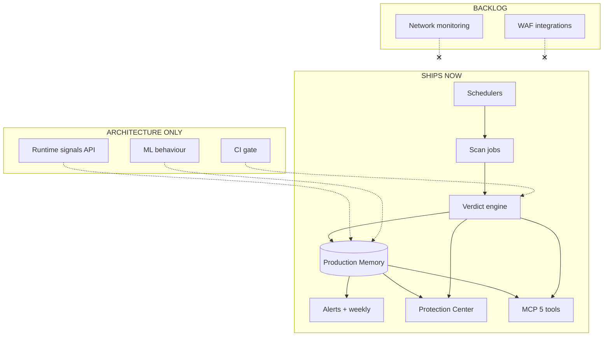

# Future Architecture Specification

**Purpose:** Separate **Hybrid V1 ships**, **architecture-only hooks**, and **backlog** for the Continuous Protection layer — so engineering does not drift into Darktrace scope.

**Authority:** [../product-bible/03-hybrid-v1-scope.md](../product-bible/03-hybrid-v1-scope.md) wins on conflicts; this doc expands Layer 2 only.

---

## Hybrid V1 — SHIPS NOW (Continuous Protection)

| Capability | Spec doc | Depends on |
|------------|----------|------------|
| CP toggle default ON | 01, 08 | GitHub + first review |
| Daily protection review | 02 | Inngest cron, scan jobs |
| Weekly protection summary | 03 | Memory aggregation |
| Monthly Protection Report | bible 06 | Memory + email |
| Security alerts V1 | 01, 02, 07 | Idempotent notifications |
| Four protection statuses | 04 | Verdict + rules |
| Production health composite | 05 | Daily snapshots |
| Dependency monitoring V1 | 06 | Lockfile + OSV critical |
| Attack surface evolution V1 | 01 | Static snapshots |
| Behaviour detection V1 (rules) | 07 | Memory |
| Protection Center UX | 08 | Web app |
| MCP read path | 09 | Five tools + Memory |
| Production Memory timeline | bible 07 | Postgres events |
| Async job reliability | bible 09, ops Phase 1.6 | Inngest |

---

## ARCHITECTURE ONLY (design hooks, no user-facing V1)

| Item | Why document | Hook |
|------|--------------|------|
| Runtime signal ingestion API | Future prod behavior without packet inspection product | `POST /internal/signals` stub + schema |
| Push-triggered review policy | Per-repo auto-review | GitHub webhook config flag |
| CI deploy gate | Block on NO-GO | Status check integration design |
| Slack / Discord alerts | Channel choice | Notification adapter interface |
| Daily snapshot table partition | Scale Memory reads | doc 09 technical |
| `am_i_protected` as dedicated tool | Only if tool cap rises | Intent already on `can_i_deploy` |
| ML behaviour detection | Replace rules post-V1 | Feature flag `behaviour.ml` |
| Multi-ecosystem deps | Go, Python, etc. | Parser plugin interface |
| Custom check frequency | Tiers later | Scheduler policy object |

**Rule:** No user marketing of architecture-only items.

---

## BACKLOG (explicit non-goals)

Do **not** implement in Continuous Protection layer V1:

| Item | Reason |
|------|--------|
| Real-time monitoring / SIEM | Out of product philosophy |
| Infrastructure / cloud / K8s scanning | Not Year 1 |
| WAF / CDN / edge rule management | Not a scanner replacement |
| Darktrace-like network AI | Bible backlog |
| Autonomous attack mitigation | No silent prod changes |
| Live attack detection | No “under attack now” |
| Full ASM internet crawl | Backlog |
| License compliance engine | Backlog |
| On-prem air-gapped deploy | Backlog |

---

## System diagram (Hybrid V1 ship boundary)

---

## Data flow constraints

1. **Append-only Memory** — all CP outputs are events (bible 07).
2. **No secrets in Memory** — lockfile content hashed, not stored.
3. **Idempotent alerts** — key = `{projectId, ruleId, day}` or `{advisoryId}`.
4. **MCP read-only for schedule** — no tool triggers cron.

---

## Scaling path (without Phase 2 infra)

| Scale | Mitigation |
|-------|------------|
| 1k projects | Stagger cron by hash |
| 10k projects | Daily snapshot rollups (technical doc 09) |
| Advisory API rate | Lockfile hash skip + cache |

Redis/Kafka **not required** for Hybrid V1 CP ship list.

---

## Promotion process

To move **ARCHITECTURE ONLY → SHIPS NOW**:

1. Amend product bible doc 03 with acceptance criteria.
2. Add/update spec in this folder.
3. Update MCP docs only if voice or intents change — **not** tool count without ADR.

---

## Implementation order (when code sprint allowed)

1. Memory event types + snapshots (foundation)
2. Daily job + status machine (doc 02 + 04)
3. Alerts idempotency
4. Weekly aggregator
5. Protection Center UI (doc 08)
6. Dependency + attack surface diff in daily path
7. Behaviour rules engine
8. Monthly report (parallel if GTM needs)
9. MCP copy parity (doc 09)

---

## Final check

Continuous Protection V1 **must not** require the founder to learn security ops vocabulary.

If a proposed feature sounds like a **scanner add-on** or **SOC dashboard**, it belongs in **BACKLOG** unless it increases **“continuously protected applications”** (north star doc 12).
