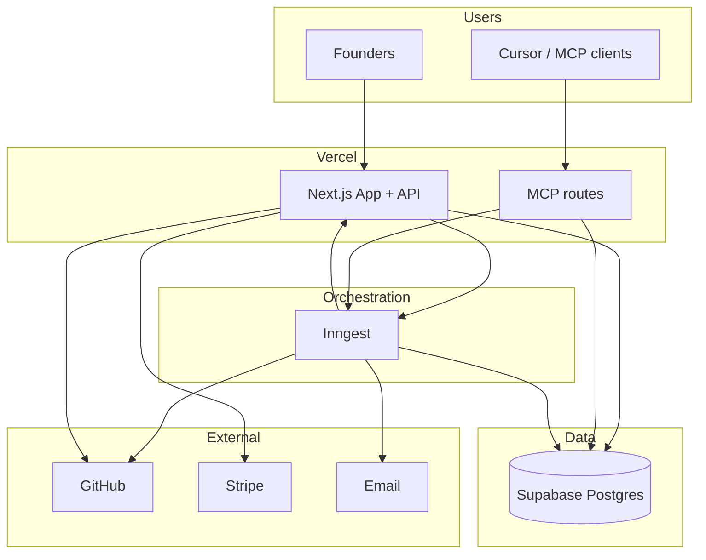

# System Context (Hybrid V1)

Single-page C4 **context** view — detail in numbered docs.

**Data flow summary:**

| Path | Flow |
|------|------|
| Protect now | MCP → job → verdict → memory |
| Protect always | Inngest → daily → memory → alerts |
| Proof | Inngest → monthly aggregator → email |
| Fix | MCP/API → recommendation → optional GitHub PR |
| Operate | Health → ops-alerts logs |

See [10-scaling-strategy.md](./10-scaling-strategy.md) for tier checklist.
