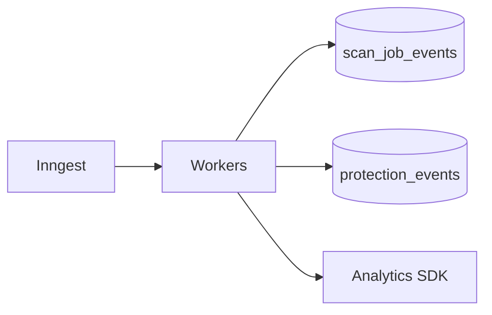

# Event Architecture (Hybrid V1)

**Principle:** Three **separate** event streams — do not merge ops, product memory, and analytics.

---

## Streams

| Stream | Storage | Purpose |
|--------|---------|---------|
| **Operational** | `scan_job_events` + structured logs | Job lifecycle, SRE |
| **Product (Memory)** | `protection_events` | Founder timeline, MCP, reports |
| **Analytics** | `track.ts` / PostHog (existing) | Funnel, not source of truth |

---

## Operational events

```
scan-run worker
  → emitOperationalEvent(type, scanJobId, payload)
  → scan_job_events row
  → stdout JSON (component: scan-job)
```

Types: queued, started, completed, failed, timeout, recovery, duplicate_prevented.

**Consumer:** health endpoint, ops-alerts ([../operations/alert-routing.md](../operations/alert-routing.md)).

---

## Product events

```
verdict / CP / fix / alert services
  → appendProtectionEvent(type, payload)
  → protection_events
```

See catalog: [../production-memory/01-project-memory-specification.md](../production-memory/01-project-memory-specification.md).

**Consumers:** memory read services, report jobs, alert dedupe (read recent).

---

## Outbox pattern (V1 light)

For side effects that must not double-fire:

```
BEGIN;
  insert protection_events …;
  insert notification_outbox (alert_id, channel) …;  -- optional table
COMMIT;

Inngest function processes outbox → email provider
```

At 1k–10k: **inline send after commit** with idempotency key is acceptable.  
At 50k: outbox table recommended — **same schema**, no Kafka required initially.

---

## GitHub webhooks

```
GitHub → Vercel route → validate signature
  → enqueue Inngest (push_received)
  → optional scan_job OR github_push_correlated memory only
```

No raw webhook body in Memory.

---

## Inngest as event bus (V1)

| Pattern | Use |
|---------|-----|
| Event → function | scan-run, cp-daily-project |
| Cron → batch | daily/weekly/monthly |
| Step sleep | recovery backoff |

**Not in V1 ship:** Kafka, NATS, SQS.

**Future adapter:** publish same JSON payload to external bus — doc 09.

---

## Ordering & consistency

- Memory is **append-only** — order by `occurred_at`.  
- Snapshots are **derived** — eventual consistency OK within minutes after job.  
- MCP reads **latest committed** snapshot — no read-your-writes across regions in V1 (single region).

---

## Diagram



---

## Related

- [03-memory-architecture.md](./03-memory-architecture.md)  
- [05-alerts-architecture.md](./05-alerts-architecture.md)
