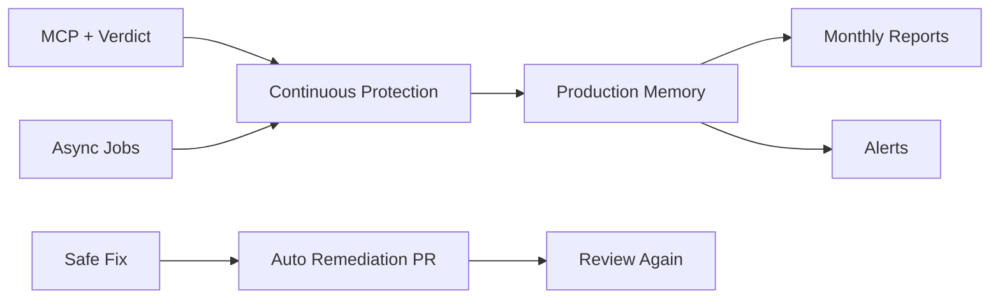

# Hybrid V1 Scope (6 Months)

**Split:** ~50% existing product (reframed) + ~50% continuous protection.  
**Window:** 6 months from bible lock (2026-07-24 → 2027-01-24).  
**Rule:** Every feature is **SHIPS NOW**, **ARCHITECTURE ONLY**, or **BACKLOG**. Nothing else exists.

**Implementation order, sprints, and beta gates:** [../roadmap/README.md](../roadmap/README.md).

---

## SHIPS NOW

### Protection before deploy (Layer 1)

| Feature | Description | Acceptance criteria |
|---------|-------------|---------------------|
| Production Verdict | Single deploy readiness answer with confidence | `can_i_deploy` / MCP returns clear GO/NO-GO + reasons in &lt; 2 min P95 first path |
| Security Review | Findings mapped to founder language | Part of verdict + `review_now` |
| Production Review | Config, env, deploy hygiene signals | Included in verdict domains |
| Reliability Review | Obvious production footguns | Included in verdict domains |
| AI Safety Review | Prompt/injection/data-leak patterns for AI apps | Included in verdict domains |
| Deployment Confidence | Score + narrative | Shown in MCP + dashboard |
| Security Confidence | Score + narrative | Shown in MCP + dashboard |
| Attack Surface Analysis V1 | Routes, auth, webhooks, secrets exposure (static) | “LOW/MED/HIGH” + top 3 worries |
| Safe Fix | Copy-paste or PR-ready fix prompts | MCP `safe_fix`; visible in project UI |
| Review Again | Re-run protection after changes | MCP `review_now` reason `after_fix` |
| MCP V1 experience | Five canonical tools + intent routing | Setup &lt; 60s; intent eval thresholds met |
| Web control plane | Onboarding, GitHub, billing, project list, protection summary | Not primary workflow |

### Continuous protection (Layer 2 — V1)

| Feature | Description | Acceptance criteria |
|---------|-------------|---------------------|
| Continuous Protection toggle | **Default ON** for connected projects | New project → scheduled checks without extra setup |
| Daily protection check | Lightweight scheduled review diff | Job completes; user notified only if material change |
| Weekly protection summary | In-app + email optional | Delivered; &lt; 2 min read |
| Monthly Protection Report | Branded report (template in vision doc) | PDF/email; metrics from memory |
| Security alerts V1 | Confidence drop, new critical, unsafe deploy attempt | In-app + email; idempotent |
| Production health V1 | Composite health from verdict + recency + open criticals | MCP + dashboard “health” |
| Dependency monitoring V1 | Manifest lockfile diff + known high-severity advisories (limited ecosystem) | Alert on new critical dep |
| Attack surface evolution V1 | Diff vs last review (new routes, auth changes) | In weekly/monthly report |
| Behaviour detection V1 | Rule-based deltas only | No ML; documented rules |
| Async job pipeline | Reliable scans/reviews (Inngest + jobs) | Phase 1.6 cutover criteria met |

### Production Memory (Layer 3 — V1)

| Feature | Description | Acceptance criteria |
|---------|-------------|---------------------|
| Project timeline | Reviews, verdicts, deploy signals, fixes, alerts | Queryable; powers `what_changed` / `production_history` |
| Confidence history | Security + production confidence over time | Chart on dashboard; MCP summary |
| Recommendations history | Past Safe Fixes and outcomes | Linked to timeline |

### Auto remediation (Layer 4 — V1, approval-gated)

| Feature | Description | Acceptance criteria |
|---------|-------------|---------------------|
| Detect → Explain | Findings with plain-language impact | Already in verdict; enriched copy |
| Recommend → Fix | Safe Fix prompt + optional diff | MCP `safe_fix` |
| PR generation V1 | Open PR with user approval | User clicks approve; no silent merge |
| Verify | `review_now` after fix | Documented workflow |
| Rollback | User reverts PR; SequrAI records outcome | Memory event |

### Go-to-market

| Item | Acceptance |
|------|------------|
| One pricing plan | Live on Stripe |
| Beta cohorts | 25 → 100 → 300 → 500 → 1,000 per [11-beta-strategy.md](./11-beta-strategy.md) |
| Positioning copy | “Protection” not “scanner” on landing + MCP instructions |

---

## ARCHITECTURE ONLY (design + hooks; no user-facing ship in V1)

| Item | Purpose |
|------|---------|
| Runtime signal ingestion API | Future “is prod behaving oddly” without Darktrace |
| Multi-region worker pool | Scale continuous checks beyond Inngest-only |
| Org-level feature flags service | Progressive cutover (already started: allowlist) |
| ML behaviour detection | Replace rule-based V1 later |
| WAF / CDN / cloud integrations | Not Year 1 |
| Team roles & SSO | Small team later |
| Second pricing tier | Designed in [10-pricing.md](./10-pricing.md); not sold |
| MCP sixth+ tools | Spec in doc 05 as *intents* mapped to five tools until promotion |
| `am_i_protected` as first-class tool | V1: composite response via `can_i_deploy` + health until tool cap changes |

---

## BACKLOG (explicitly not Hybrid V1)

- Darktrace-class network/runtime monitoring
- Infrastructure / cloud / multi-cloud security
- Automatic production remediation without approval
- Enterprise compliance packs (SOC2, ISO sales-led)
- On-prem / air-gapped
- Custom SIEM integrations
- Bug bounty platform
- Penetration test marketplace
- Full ASM crawling of internet-facing assets
- White-label MSSP

---

## Dependencies between ships

---

## Out of scope for engineering arguments

If a proposal is not listed under **SHIPS NOW**, it requires a bible amendment (frozen for 6 months).

---

## Final recommendation test

Hybrid V1 **SHIPS NOW** list, when delivered, satisfies:

> A Cursor founder afraid of hacks and bad deploys gets MCP protection, deploy confidence, continuous watching, memory, alerts, monthly proof, and approval-gated fixes—**without** learning security.

**Answer:** **YES** (contingent on shipping the SHIPS NOW table, not ARCHITECTURE ONLY items).
