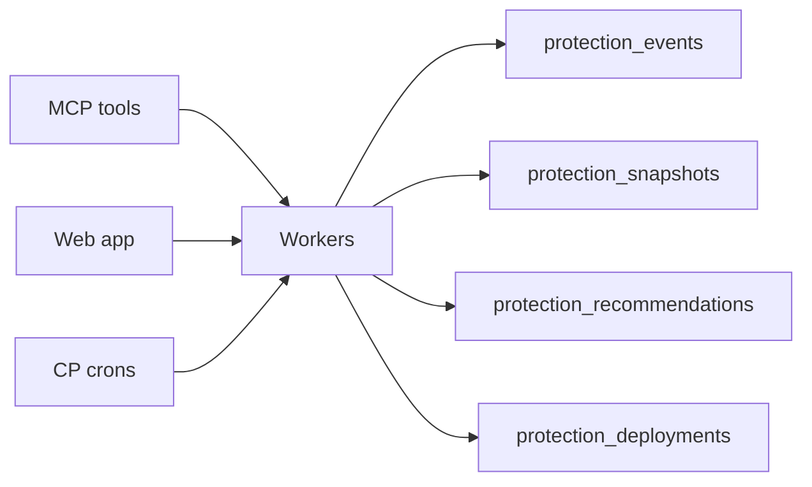

# Project Memory Specification

**Role:** The **canonical append-only stream** of everything SequrAI learns about a project. All other memory domains are **views or rollups** over this stream (plus a few normalized tables for query performance).

---

## Strategic intent

Competitors can run a scan. SequrAI **remembers**:

- Every protection review and verdict
- Every deploy readiness check (GO / NO-GO / NOT YET)
- Every Safe Fix and whether it worked
- Every daily/weekly/monthly protection cycle
- Confidence and health over months

That history is the moat behind *"SequrAI knows my application better than I do."*

**Not a history page:** Founders never browse raw logs. They see **tenure**, **milestones**, and **trends** derived from memory ([08-protection-timeline-specification.md](./08-protection-timeline-specification.md)).

---

## What matters to founders (stored or derived)

| Founder mental model | Memory source |
|------------------------|---------------|
| *How long have you protected my app?* | `project_memory_profile.continuous_protection_days` |
| *What stack am I running?* | `stack_fingerprint` (inferred labels: Next.js, Stripe, …) |
| *What improved?* | Milestones + `fix_verified` + confidence deltas |
| *What did you stop me from shipping?* | `deploy_blocked` count |
| *What's still open?* | `protection_recommendations` status open |
| *Am I safer than last month?* | Snapshot compare + security/production confidence series |

---

## How projects evolve over time (memory narrative)

| Evolution dimension | Captured by |
|---------------------|-------------|
| Major changes | Material events + attack surface / dependency snapshots |
| Security improvements | fix_verified + security confidence ↑ |
| Production improvements | fix_verified + production confidence ↑ |
| Protection maturity | Status transitions PROTECTED ↔ … |
| Recommendation debt | Open vs verified ratio over time |

**Smarter over time (V1):** Recurring worries bump priority in Safe Fix ranking; tenure enables copy *"327 days protected"* — no ML required.

---

## Stack fingerprint (project profile)

Updated on each full review — **labels only**, not dependency tree storage.

| Signal | Example stored |
|--------|----------------|
| Framework | nextjs, remix |
| Hosting hints | vercel.json present |
| Payments | stripe SDK detected |
| Auth | clerk, supabase-auth |
| Database | supabase, prisma |

Used for: MCP context (*"for a Next.js + Stripe app…"*), future stack packs — **backlog**.

See [11-data-model-specification.md](./11-data-model-specification.md) `project_memory_profile`.

---

## Principles

| # | Principle | Implication |
|---|-----------|-------------|
| 1 | **Append-only** | Corrections are new events; never mutate or delete user-visible history (GDPR delete is tenant-level exception). |
| 2 | **No secrets** | See [What must never be stored](#what-must-never-be-stored). |
| 3 | **Project-scoped** | Key: `organizationId` + `projectId`. No cross-project leakage in user APIs. |
| 4 | **Sanitized payloads** | Plain-language summaries, IDs, counts, hashes — not raw repo content. |
| 5 | **MCP-first read** | `production_history` and `what_changed` are thin, opinionated views — not raw event dumps. |
| 6 | **Retention** | Minimum **12 months** timeline + confidence series (Hybrid V1). |

---

## What should be stored

### Event envelope (every record)

| Field | Purpose |
|-------|---------|
| `id` | UUID |
| `organizationId` | Tenancy |
| `projectId` | Tenancy |
| `occurredAt` | ISO timestamp (UTC storage; display in user TZ) |
| `type` | Event type enum (below) |
| `payload` | JSON, schema per type |
| `scanId` | Optional link to scan |
| `scanJobId` | Optional link to job |
| `idempotencyKey` | Optional dedupe for workers |

### Event types (Hybrid V1 — complete catalog)

| Type | Writer | Payload highlights |
|------|--------|-------------------|
| `protection_review_started` | MCP / web / scheduler | `{ trigger: mcp|web|daily|weekly|push, reason? }` |
| `protection_review_completed` | Scan job | `{ sha, branch, durationMs, findingCounts: { critical, high, med, low } }` |
| `verdict_created` | Verdict engine | `{ verdictId, deployAnswer, productionConfidence, securityConfidence, worriesTop3[], attackSurfaceLevel }` |
| `deploy_readiness_checked` | `can_i_deploy` | `{ deployAnswer, productionConfidence, securityConfidence, stale: boolean }` |
| `deploy_blocked` | `can_i_deploy` NO-GO | Same + `{ primaryBlockerPlain }` |
| `deploy_ready` | `can_i_deploy` GO | Same |
| `safe_fix_generated` | `safe_fix` | `{ recommendationId, titlePlain, severity, findingId? }` |
| `fix_pr_opened` | GitHub flow | `{ recommendationId, prNumber, prUrl }` |
| `fix_verified` | Post-fix review | `{ recommendationId, verdictId, deployAnswerAfter }` |
| `recommendation_dismissed` | User | `{ recommendationId, reasonPlain? }` |
| `continuous_check_completed` | Daily CP | `{ sha, material: false }` |
| `material_change_detected` | Daily / rules | `{ reasons[], previousStatus, newStatus }` |
| `alert_sent` | Notifications | `{ channel, alertKind, dedupeKey }` |
| `confidence_snapshot` | Daily / review | `{ productionConfidence, securityConfidence, healthScore, healthLabel, protectionStatus }` |
| `attack_surface_snapshot` | Review / daily | `{ level, delta, highlightsPlain[] }` |
| `dependency_snapshot` | Daily | `{ lockfileHash, changedPackageCount, newCriticalAdvisories[] }` |
| `protection_status_updated` | Status machine | `{ from, to, ruleIds[]? }` |
| `behaviour_signal` | Rule engine | `{ ruleId, summaryPlain }` |
| `protection_paused` | User | `{ byUserId }` |
| `protection_resumed` | User | `{ byUserId }` |
| `weekly_summary_generated` | Weekly job | `{ summaryId, weekStart, confidenceDelta }` |
| `monthly_report_generated` | Monthly job | `{ reportId, month, metrics }` |
| `github_push_correlated` | Webhook | `{ sha, branch }` — no payload bodies |
| `fix_reverted` | Review detects regression | `{ recommendationId, summaryPlain }` |
| `protection_milestone_reached` | Milestone worker | `{ milestoneType, titlePlain }` |

### Normalized companions (logical tables)

| Table | Purpose |
|-------|---------|
| `protection_snapshots` | One row per project per day (rollup for charts + `what_changed`) |
| `protection_recommendations` | Current state of each recommendation |
| `protection_deployments` | Deploy-check and push-correlated deploy rows |
| `project_memory_profile` | Tenure, counters, stack fingerprint |
| `protection_milestones` | Sparse founder-facing highlights |

Physical schema may merge; **logical separation** is required for tests and MCP contracts.

---

## What must never be stored

| Category | Examples | Alternative |
|----------|----------|-------------|
| **Secrets** | API keys, tokens, `.env` values, private keys | “Secret pattern detected in file X” (path only if needed) |
| **Source code** | File bodies, full diffs | Finding titles, plain-language worry |
| **PII from prod** | User emails from logs, customer data | Aggregated counts only |
| **Raw webhooks** | Full GitHub payload | sha, branch, event type |
| **Full lockfiles** | package-lock content | Hash + package name/version deltas |
| **MCP prompts** | User chat transcripts | Not memory — separate analytics if ever |
| **Payment data** | Card numbers | Stripe IDs in billing tables only |

**Red team rule:** If a Postgres export leaked, a founder should **not** be able to reconstruct credentials or customer data from Memory alone.

---

## Daily, weekly, monthly memory updates

| Cadence | Memory writes | Primary consumer |
|---------|---------------|------------------|
| **Daily** | `continuous_check_completed` or review + `confidence_snapshot`, optional `dependency_snapshot`, `attack_surface_snapshot`, `protection_status_updated` | CP silent success; `what_changed` vs yesterday |
| **Weekly** | `weekly_summary_generated` + aggregation reads (no duplicate verdicts) | Weekly card, `production_history` 7d |
| **Monthly** | `monthly_report_generated` + metric rollups | Email/PDF, investor story |
| **On demand** | Full review chain on `review_now`, deploy checks on `can_i_deploy`, fixes on `safe_fix` | MCP + Protection Center |

See [../continuous-protection/02-daily-protection-review-specification.md](../continuous-protection/02-daily-protection-review-specification.md) for CP job detail.

---

## Founder experience (memory-backed)

Founders **do not** browse “events.” They feel:

- **Continuity:** “SequrAI noticed before I did.”
- **Story:** “We fixed rate limiting last month — confidence went up.”
- **Proof:** Weekly/monthly artifacts without manual work.

Memory UX (doc 09) translates events into **timeline**, **sparklines**, and **one-line highlights**.

---

## Write path (conceptual)

**Invariant:** 100% of completed reviews emit at least `protection_review_completed` + `verdict_created` (+ `confidence_snapshot`).

---

## Read path (conceptual)

| Consumer | Pattern |
|----------|---------|
| `what_changed` | Snapshot N vs N-1 (or last two `verdict_created`) |
| `production_history` | Snapshots + curated events → narrative |
| Protection Center | Latest snapshot + last 10 timeline events |
| Monthly report | Aggregates doc in bible 07 |

---

## Indexing & scale (design)

- `(project_id, occurred_at DESC)` — timeline
- `(project_id, type, occurred_at DESC)` — filtered history
- `(organization_id, occurred_at DESC)` — portfolio (future)

Daily snapshot precompute avoids scanning full event log for charts at 10k projects (technical doc 09).

---

## Related specs

| Domain | Doc |
|--------|-----|
| Protection History | [02-protection-history-specification.md](./02-protection-history-specification.md) |
| Deployment History | [03-deployment-history-specification.md](./03-deployment-history-specification.md) |
| Confidence / health | [04](./04-production-confidence-history-specification.md)–[07](./07-project-health-history-specification.md) |
| Timeline & UX | [08](./08-protection-timeline-specification.md), [09](./09-memory-ux-specification.md) |
| MCP | [10-memory-mcp-experience-specification.md](./10-memory-mcp-experience-specification.md) |
| Ship scope | [11-future-architecture-and-scope.md](./11-future-architecture-and-scope.md) |

---

## Acceptance criteria (Hybrid V1)

- Every completed review → ≥ 2 memory events (completed + verdict).
- Idempotent writes for alerts and daily checks (same key → one row).
- `what_changed` meaningful for ≥ 90% of projects with 2+ snapshots.
- Monthly report fields bind to Memory with zero manual editing (bible 07 table).
