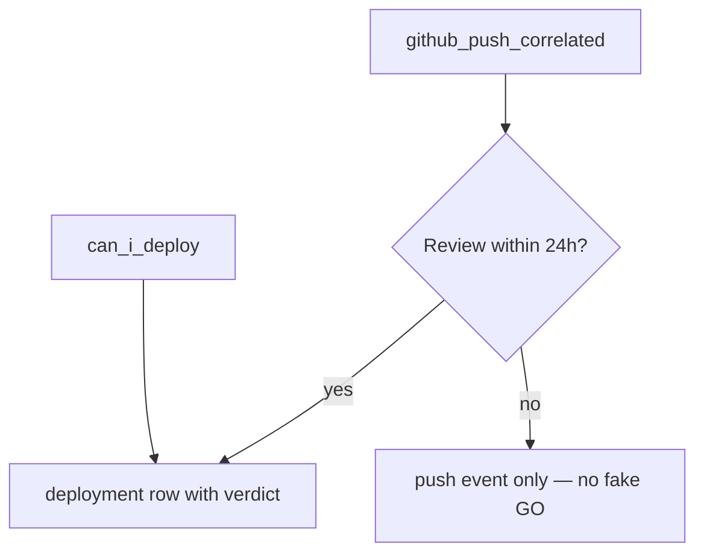

# Deployment History Specification

**Definition:** Memory of **deploy readiness decisions** and **shipping-related signals** — when the founder (or CI correlation) asked *can I ship?* and what SequrAI said at that moment.

**Founder question answered:** *Would SequrAI have let me deploy? When did I hesitate?*

---

## What should be stored

### Primary events

| Type | When | Stored payload |
|------|------|----------------|
| `deploy_readiness_checked` | Any `can_i_deploy` | `{ deployAnswer, productionConfidence, securityConfidence, sha?, stale }` |
| `deploy_blocked` | NO-GO | + `{ primaryBlockerPlain }` |
| `deploy_ready` | GO | Same as checked |
| `github_push_correlated` | Push to default branch | `{ sha, branch }` — links to verdict at correlation time if review ran |

### Normalized table: `protection_deployments`

| Column | Purpose |
|--------|---------|
| `id` | UUID |
| `projectId` | Scope |
| `occurredAt` | Time |
| `sha` | Commit (nullable for MCP-only check without SHA) |
| `branch` | Branch name |
| `deployAnswer` | GO / NO-GO / NOT YET |
| `productionConfidence` | Snapshot |
| `securityConfidence` | Snapshot |
| `source` | `mcp` \| `web` \| `github_push` |
| `verdictId` | Link to verdict used |

**Append-only semantics:** New deploy check = new row + event. Do not overwrite “last deploy answer.”

---

## What should never be stored

- Production URLs with auth tokens
- CI logs
- Deployment secrets or Vercel tokens
- User’s actual deploy action (we infer **intent** from checks and pushes only)

---

## Correlation rules (V1)



**Rule:** Never invent GO because a push happened without a review.

---

## Founder experience

### Protection Center (optional section)

**Deploy confidence log** — max 5 rows visible:

```
Recent deploy checks
• Today — NOT YET — rate limiting (MCP)
• Mar 12 — GO — confidence 91%
• Mar 10 — NO-GO — unsafe auth flow (blocked)
```

Copy for blocked:

> *SequrAI would not have been comfortable with that deploy.*

### Monthly report metrics

| Metric | Source |
|--------|--------|
| Unsafe deployments prevented | Count `deploy_blocked` in period |
| Deploy checks | Count all deploy_* events |
| Confidence at last GO | Latest `deploy_ready` |

---

## MCP experience

| User | Tool | Deployment history |
|------|------|-------------------|
| Can I deploy? | `can_i_deploy` | Writes new row; may reference “last time you asked…” |
| Would you have blocked my last deploy? | `production_history` | Narrative from last push + verdict |
| How often do I get NO-GO? | `production_history` | Count / pattern — ties to behaviour BD-04 |

**Voice example:**

> *You've asked about deploy three times this week — each time the blocker was the same: missing rate limiting.*

---

## Daily / weekly / monthly

| Cadence | Deployment history |
|---------|-------------------|
| Daily | New rows only when user runs `can_i_deploy` or push+review |
| Weekly | Highlight repeated NO-GO (BD-04) in weekly summary |
| Monthly | “Unsafe deployments prevented” counter |

---

## Acceptance criteria

- Each `can_i_deploy` invocation → exactly one deploy event (idempotent per request id).
- Portfolio does not show deploy log — project drill-down only.
- History supports monthly report counters without ad-hoc SQL on raw MCP logs.
