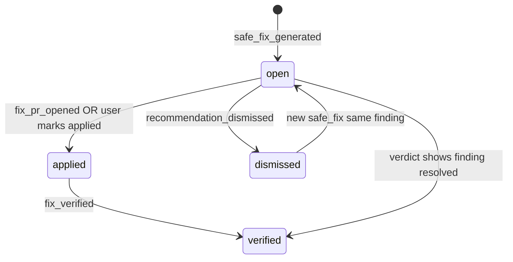

# Recommendations History Specification

**Definition:** Durable record of every **Safe Fix** and system-generated **recommendation** — what SequrAI asked the founder to do, and what happened next.

**Founder question answered:** *What should I fix next? Did we already fix that?*

---

## What should be stored

### Table: `protection_recommendations`

| Field | Purpose |
|-------|---------|
| `id` | recommendationId |
| `projectId`, `organizationId` | Scope |
| `createdAt`, `updatedAt` | Lifecycle |
| `titlePlain` | Founder-language title |
| `severity` | internal: critical / high / med / low |
| `status` | `open` \| `applied` \| `dismissed` \| `verified` |
| `findingId` | Optional link to finding |
| `verdictId` | Origin verdict |
| `safeFixVersion` | Hash or version of prompt template |
| `dismissedReasonPlain` | Optional |

### Events (append-only)

| Type | Effect on recommendation |
|------|--------------------------|
| `safe_fix_generated` | Create or bump `open` |
| `fix_pr_opened` | Status → `applied` (pending verify) |
| `fix_verified` | Status → `verified` |
| `recommendation_dismissed` | Status → `dismissed` |
| `verdict_created` | May auto-resolve if finding gone → `verified` |

### What we store for Safe Fix content

| Store | Do not store |
|-------|--------------|
| Title, severity, status, timestamps | Full multi-KB prompt in Memory (optional short hash; full prompt in fix engine store if needed with TTL) |
| Link to finding **title** plain | Source code snippets |

**Hybrid V1:** Store **truncated prompt fingerprint** (hash) for verify-audit; user retrieves live prompt via `safe_fix` again.

---

## What should never be stored

- API keys embedded in fix prompts
- Copy-paste of `.env` example values with real secrets
- User’s Cursor chat

---

## Lifecycle



---

## Founder experience

### Protection Center

**Recommendation** hero is always **one primary open** item:

```
Recommendation:
Apply Safe Fix — Add rate limiting to public API routes

Status: Open since Mar 10
[ Apply Safe Fix ] [ Copy fix for Cursor ]
```

**History link:** “Past fixes” → list last 10 `verified` with dates.

### Copy

| Status | Label |
|--------|-------|
| open | *Still on my list* |
| applied | *Waiting to verify* |
| verified | *Fixed — confidence improved* |
| dismissed | *You chose to skip* |

---

## MCP (`safe_fix` + history reads)

| Action | Tool |
|--------|------|
| Fix this problem | `safe_fix` | writes `safe_fix_generated` |
| What should I fix first? | `can_i_deploy` → `safe_fix` if needed |
| Did we fix X? | `production_history` | searches verified recommendations |

**Voice:**

> *We fixed the unsafe auth flow on Mar 12 — verified on review. What's still open is rate limiting.*

---

## Daily / weekly / monthly

| Cadence | Recommendations history |
|---------|-------------------------|
| Daily | Auto-resolve check on new verdict (finding absent) |
| Weekly | “Fixes verified this week: n” |
| Monthly | “Critical issues addressed” = count `verified` where severity critical |

---

## Acceptance criteria

- Every `safe_fix` MCP call creates or updates recommendation row.
- Protection Center primary CTA matches top open critical/high recommendation.
- Monthly metric matches event count ± 0.
