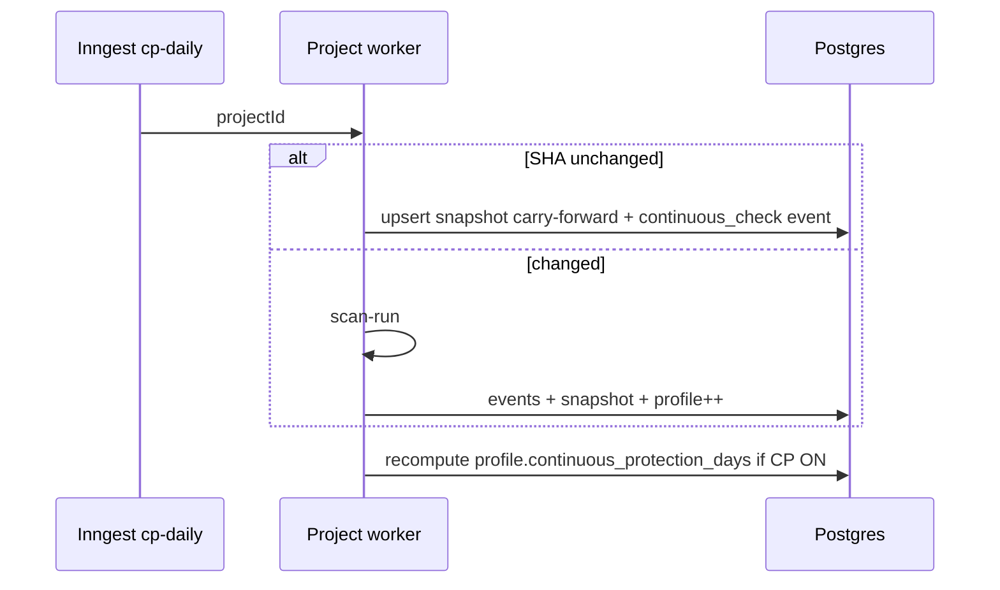

# Update Strategy Specification

**Purpose:** When Memory **changes** — daily, weekly, monthly, and event-driven — so all consumers stay consistent.

**Stack:** Inngest crons + scan job hooks + MCP/API writes. **Postgres** only.

---

## Update matrix

| Trigger | What updates | Frequency |
|---------|--------------|-----------|
| **Daily CP job** | snapshot, profile counters, maybe events | 1× per project per day |
| **Weekly job** | weekly_summary cache, profile deltas, milestone check | 1× per project per week |
| **Monthly job** | monthly_report cache, milestone | 1× per project per month |
| **Protection review complete** | events, snapshot, profile stack, milestones | On demand + scheduled |
| **can_i_deploy** | deployment row + event | Per invocation |
| **safe_fix** | recommendation + event | Per invocation |
| **fix verified** | recommendation, event, profile counters, alert resolve | After review_now |
| **Material alert** | event alert_sent, notification | Idempotent |
| **CP pause/resume** | events, profile streak reset/resume | User action |
| **GitHub push** | event correlate optional | Webhook |

---

## Daily updates (Continuous Protection)

**Snapshot rule:** At least one row per eligible day; `content_hash` skip heavy writes if identical.

**Profile:** Increment `total_daily_checks`; update `last_material_change_at` if material.

---

## Weekly updates

1. Aggregate last 7 snapshots → confidence deltas.  
2. Write `weekly_summary_generated` event + optional `protection_weekly_summaries` row.  
3. Evaluate milestone rules (e.g. 7/7 checks).  
4. Feed MCP `production_history` builder (same SQL).

**No full rescan** unless zero daily checks in window.

---

## Monthly updates

1. Aggregate month snapshots + event counts (prevented, fixed, alerts).  
2. Write `monthly_report_generated` + report cache.  
3. Update lifetime deltas on profile.  
4. Email sender reads cache only.

---

## Protection event updates (real-time)

| Event source | Latency target |
|--------------|----------------|
| Verdict after scan | &lt; 60s after job complete |
| deploy check | Sync with MCP response |
| safe_fix | Sync |
| Alert | &lt; 2 min after material detect |

All via same `appendProtectionEvent` + transactional snapshot patch when review completes.

---

## Deployment updates

Each `can_i_deploy`:

1. Insert `protection_deployments`.  
2. Append `deploy_readiness_checked` or blocked/ready.  
3. If NO-GO: increment `profile.total_unsafe_prevented` (or derive from count — single source: event count in monthly job to avoid drift).

**Recommendation:** Profile counters **recomputed nightly** from events to fix drift; incremental ++ for realtime UI optional.

---

## Consistency rules

| Rule | Detail |
|------|--------|
| Single snapshot id per day | Upsert wins |
| MCP reads | Latest committed snapshot + profile |
| Reports | Point-in-time snapshot_ids in report row |
| what_changed | Compare snapshot dates or verdict ids |

Eventual consistency OK **&lt;5 min** between event and snapshot; MCP labels stale if &gt;36h daily miss.

---

## Failure & catch-up

| Failure | Catch-up |
|---------|----------|
| Missed daily | Next cron runs; profile shows gap honestly |
| Missed week | Skip week card; do not fabricate |
| Job partial write | Outbox retry (architecture at scale) |

---

## Related

- [02-dependencies](../roadmap/02-dependencies-and-build-order.md) — Memory before CP  
- [../hybrid-v1-architecture/03-memory-architecture.md](../hybrid-v1-architecture/03-memory-architecture.md)

---

## Acceptance criteria

- Daily update completes for 99% projects within 26h window.  
- Weekly/monthly jobs read-only on verdict engine.  
- No consumer reads raw event table for sparklines at 10k+ projects.
