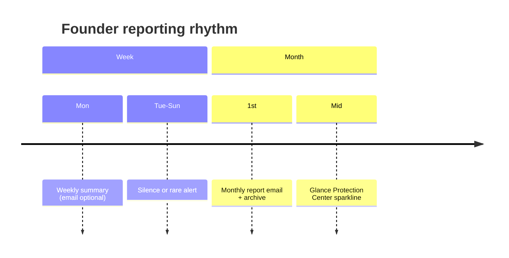

# Founder Experience Specification

**Purpose:** How weekly and monthly reports **feel** in a founder's life — the emotional payoff of continuous protection.

---

## Jobs to be done

| Job | Report |
|-----|--------|
| *Am I crazy to ignore security?* | Monthly proof |
| *Did SequrAI earn the subscription?* | Stats + narrative |
| *What do I tell my co-founder?* | Forward monthly email |
| *What do I do Monday morning?* | Weekly one CTA |
| *Are we ready to launch harder?* | Summary + worries |

---

## Rhythm

**Expectation setting (onboarding):**

> *Most days you'll hear nothing. Mondays you'll get the week. Each month you'll get proof.*

---

## First month journey

| Week | Experience |
|------|------------|
| 1 | No monthly yet; weekly after day 7 |
| 2–3 | Weekly builds habit |
| End month 1 | First monthly — celebrate checks completed |

First monthly subject: *“Your first month protected by SequrAI”* variant.

---

## Reading modes

| Mode | Time | Format |
|------|------|--------|
| Skim | 30s | Status + one recommendation |
| Read | 3 min | Full monthly |
| Forward | 10s | Investor glances statistics block |

Design **inverted pyramid:** four questions answered in first screen.

---

## Emotional beats

| Beat | Copy direction |
|------|----------------|
| Pride | *You verified 2 fixes — confidence up 11 points.* |
| Calm | *28/30 days watched — nothing material on 26 of them.* |
| Honest concern | *I'm still worried about {x} — here's the fix.* |
| No fear mongering | Never *“you could have been hacked”* without evidence in Memory |

---

## Settings

| Toggle | Default |
|--------|---------|
| Weekly email | OFF beta / optional paid |
| Monthly email | ON paid |
| Report archive | Always in app |

Unsubscribe monthly → still can read in app; in-app banner once.

---

## Relationship to alerts

| Channel | Feeling |
|---------|---------|
| Alert | *Stop — look now* |
| Weekly | *Here's your week* |
| Monthly | *Here's your record* |

See [../security-alerts/06-founder-experience-specification.md](../security-alerts/06-founder-experience-specification.md).

---

## Success signals

- Monthly forward rate ≥ 15% (beta target)  
- Founders cite report in investor updates (qual)  
- “Am I becoming more protected?” answered yes/no without opening GitHub  

---

## Acceptance criteria

- User test: founder answers four report questions from email alone.  
- First-month and partial-month templates ship.  
- Report accessible without login? **No** — auth required; share via forward only (export link backlog).
