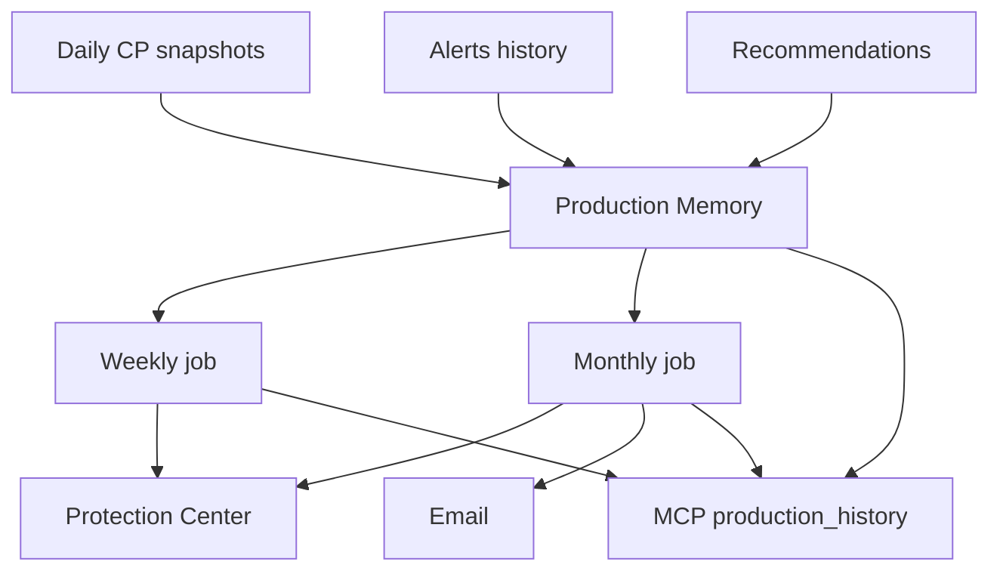

# Future Roadmap Specification

**Purpose:** SHIPS NOW vs architecture-only vs backlog for **Protection Reports** (weekly + monthly + summaries).

**Authority:** [../product-bible/03-hybrid-v1-scope.md](../product-bible/03-hybrid-v1-scope.md).

---

## SHIPS NOW (Hybrid V1)

| Item | Doc |
|------|-----|
| Monthly Protection Report (email + archive) | 01 |
| Weekly Protection Summary (in-app + optional email) | 02 |
| Protection summary narrative block | 03 |
| Confidence trends in reports | 04 |
| Single recommendation in reports | 05 |
| Project evolution section | 06 |
| Protection statistics block | 07 |
| Founder rhythm & settings | 08 |
| MCP via `production_history` | 09 |
| `monthly_report_generated` / `weekly_summary_generated` Memory events | production-memory 01 |
| Data binding zero manual edit | 01, 07 |
| Branded HTML template | 01 |
| Alerts summarized in monthly (not re-fired) | security-alerts 09 |

**Acceptance:** Monthly open rate ≥ 40% beta; weekly read &lt; 2 min.

---

## ARCHITECTURE ONLY

| Item | Purpose |
|------|---------|
| PDF generation service | Async render queue |
| Signed URL archive storage | S3/Vercel Blob |
| Org-level rollup report | Agency view — not V1 |
| Custom report schedule | Per-project TZ already; custom day backlog |
| White-label PDF for partners | GTM later |
| Embeddable “protection badge” widget | Marketing |
| Public share link (read-only, expiring) | Investor link without account |
| i18n report templates | Post-English V1 |

---

## BACKLOG

| Item | Reason |
|------|--------|
| Quarterly board deck auto-deck | Sales-led |
| Comparison to other startups | Privacy |
| Full findings appendix PDF | Scanner vibe |
| CSV export of all events | Engineer tool — optional later |
| Slack delivery of weekly | Integrations backlog |
| AI-generated prose without Memory grounding | Trust risk |
| Separate MCP report tool | Tool cap |
| Compliance mappings (SOC2 sections) | Enterprise backlog |

---

## Implementation order (when code allowed)

1. Memory aggregators (week/month boundaries)  
2. Weekly narrative job + in-app card  
3. Monthly narrative job + email  
4. Protection Center Reports archive  
5. PDF optional  
6. MCP formatter parity tests  
7. i18n / share link if promoted  

---

## Dependency graph

---

## Governance

New report sections require:

- Product bible doc 03 update if user-visible  
- Answer mapping to four founder questions  
- No increase in email frequency without philosophy review  

---

## North star

Reports exist so founders **stop auditing SequrAI** and start **trusting** it.

If a proposed report section does not help answer:

- Am I becoming more protected?  
- What improved?  
- What worries SequrAI?  
- What should I do next?  

→ **Do not ship it.**
