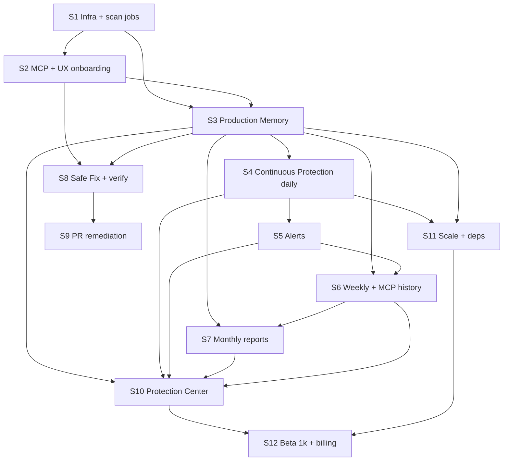

# Dependencies and Build Order

**Rule:** Lower layers must ship before dependent product surfaces.

---

## Dependency graph

---

## Strict build order (single sequence for planning)

| Order | Block | Why first |
|-------|-------|-----------|
| 1 | Async jobs reliable (S1) | Everything else queues scans |
| 2 | Verdict + MCP read/write basics (S2) | Primary user workflow |
| 3 | Memory events + snapshots (S3) | CP, alerts, reports, diff |
| 4 | Daily CP + status (S4) | NSM definition requires CP ON + recency |
| 5 | Alerts (S5) | Depends on material change from CP |
| 6 | Weekly aggregators (S6) | Reads memory; feeds MCP history |
| 7 | Monthly aggregators (S7) | Reads memory + weekly metrics |
| 8 | Safe Fix + verify loop (S8) | Uses memory recommendations |
| 9 | PR path (S9) | After Safe Fix stable |
| 10 | Protection Center UI (S10) | Aggregates all read models |
| 11 | Scale + dependency/advisory (S11) | Before 500+ users |
| 12 | Billing + 1k cohort (S12) | GTM capstone |

---

## Cross-layer dependencies (product bible)

| Feature | Depends on |
|---------|------------|
| `what_changed` | Snapshots + verdicts |
| `production_history` | Snapshots + events + weekly builder |
| Daily CP | Memory + scan_jobs + GitHub |
| Alerts | CP/verdict delta + dedupe store |
| Monthly report | Memory + alert counts + recommendations |
| PR remediation | GitHub App write + recommendations + approval audit |
| Protection Center | Status + snapshot + alerts unread + reports |
| NSM metric | CP ON + review &lt;14d + GitHub connected |

---

## Infrastructure dependencies

| Item | Before |
|------|--------|
| Prod Inngest cutover | Staging A–L + soak |
| Beta 25 | S4 CP daily in prod |
| Beta 100 | S5 alerts + S6 weekly live |
| Beta 300 | S7 monthly + S8 verify |
| Beta 500 | S10 Protection Center |
| Beta 1000 | S11 scale checklist + S12 Stripe |

---

## Documentation → code order

Design packs are **frozen** before sprint starts:

| Sprint | Spec authority |
|--------|----------------|
| S2 | mcp-product, ux-sprint |
| S3–S4 | production-memory, continuous-protection |
| S5 | security-alerts |
| S6–S7 | protection-reports |
| S8–S9 | auto-remediation |
| S10 | CP Protection Center + memory UX |
| S11–S12 | hybrid-v1-architecture scaling |

---

## Forbidden shortcuts

| Shortcut | Why blocked |
|----------|-------------|
| Alerts before snapshots | Diff noise, false positives |
| Monthly before weekly | No narrative builder reuse |
| PR before verify loop | No `fix_verified` story |
| Protection Center before status machine | Empty hero |
| New MCP tool to “speed up” | Bible + ADR frozen at five |

---

## Amendment process

Change build order or add scope → update **this file**, [07-feature-to-sprint-map.md](./07-feature-to-sprint-map.md), and bible doc 03 in one PR.
