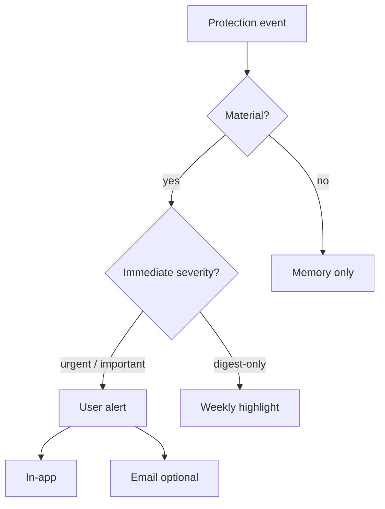

# Alert Philosophy Specification

**One sentence:** Alerts are **SequrAI tapping your shoulder** — not a scanner feed, not SOC paging, not “you have vulnerabilities.”

---

## Core beliefs

| Belief | Implication |
|--------|-------------|
| **Silence is success** | Most days: zero notifications. Protection still ran. |
| **Material only** | If it doesn’t change what a founder should do this week, it’s Memory — not an alert. |
| **Opinion first** | Lead with *“I’m worried about…”* not counts or CVE IDs. |
| **One action** | Every alert ends with exactly one recommended next step. |
| **Idempotent respect** | Same issue, same day → one alert. No reminder spam. |
| **No attack theater** | We do not claim live intrusion detection or “under attack now.” |

---

## What we alert vs what we log



| Outcome | Founder sees |
|---------|--------------|
| Daily check, nothing material | Nothing (maybe “Last checked today” in app) |
| New medium finding, stable confidence | Weekly highlight only |
| New critical finding | Immediate alert |
| Confidence −12 in 24h | Immediate alert |
| Third NO-GO deploy check in 7d | Weekly highlight (not 3 emails) |

---

## The three alert questions

Every user-facing alert template **must** answer:

### 1. Should I worry?

Use protection-framed language:

- *“Yes — this needs attention before your next deploy.”*
- *“Not urgently — but I'm watching it.”* (weekly only)
- *“No — nothing material changed.”* (no alert sent)

Map to severity (doc 03): **Urgent**, **Important**, **Digest**.

### 2. What changed?

Max **three** bullets, plain language:

- *“New public API route without authentication.”*
- *“Production confidence dropped from 94% to 82%.”*

Never lead with CVE-2024-xxxx.

### 3. What should I do next?

Single CTA:

- Apply Safe Fix  
- Review again in Cursor  
- Turn continuous protection back on  
- Open Protection Center  

---

## Noise budget

**Definition:**

```
noise_rate = user_alerts_sent / daily_protection_checks_completed
```

**Hybrid V1 target:** `noise_rate < 0.05` (5%).

**Levers:**

- Strict material definition (CP doc 01)
- Dedupe keys (doc 05)
- Route low-urgency signals to **weekly digest** only (doc 08)
- No email for `deploy_blocked` by default (in-app only)
- No alert on every `review_now` — only on **material delta** vs last snapshot

**False positive (founder-facing):** Alert that did not change their action or understanding. Track via dismiss + “was this helpful?” (optional V1 survey).

---

## Channels (V1)

| Channel | Use |
|---------|-----|
| **In-app** | All Urgent + Important alerts; inbox badge |
| **Email** | Opt-in; Urgent + Important only; never digest spam daily |
| **Push** | Backlog |
| **Slack/Discord** | Architecture only (doc 11) |

Default: **in-app ON**, **email OFF** in beta → **email ON** for paid default (product bible) with same material rules.

---

## Relationship to protection status

Alerts **follow** status (doc 04), not replace it:

| Status | Alert role |
|--------|------------|
| PROTECTED | Usually no alert |
| SAFE WITH CAUTION | Important alert only if **new** since last notify |
| REQUIRES ATTENTION | Urgent alert on transition + material updates |
| NOT PROTECTED | Alert on pause/disconnect; not daily nag |

---

## What SequrAI is not

- PagerDuty for your infra  
- GitHub Dependabot email flood  
- Real-time WAF / IDS  
- “47 new vulnerabilities” marketing emails  

---

## Success criteria

- Founders describe alerts as *“only when it matters.”*  
- Email opt-out rate &lt; 20% after 90 days (signal of trust).  
- noise_rate &lt; 5% measured monthly.
