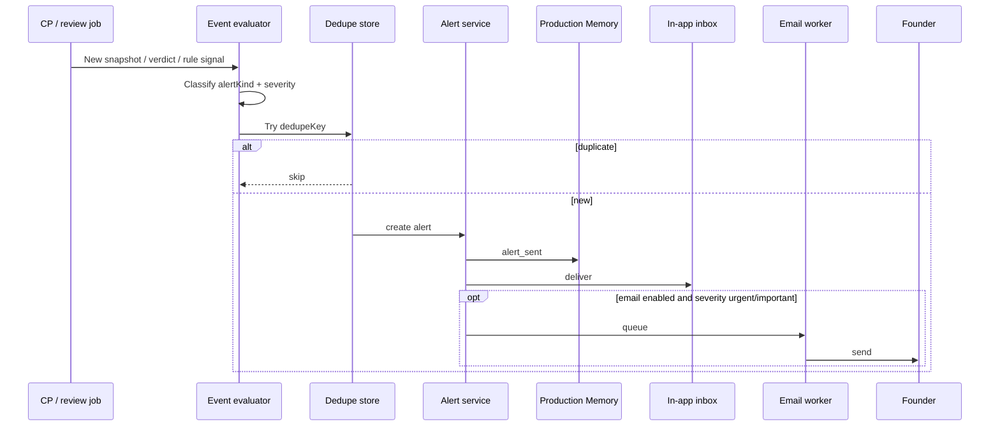
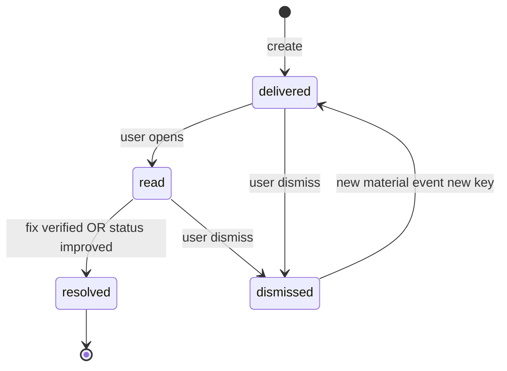

# Alert Workflows Specification

**Purpose:** End-to-end flow from **detection → dedupe → deliver → resolve → Memory** — for engineering and product alignment.

---

## High-level pipeline

---

## Evaluator inputs

| Source | Evaluator |
|--------|-----------|
| Daily CP job | Material change + snapshots |
| `review_now` completion | Delta vs previous verdict |
| `can_i_deploy` | AT-11 deploy_blocked (digest) |
| Behaviour engine | BD-01–07 |
| Integration health | GitHub disconnect |
| Job watchdog | AT-12 check_delayed |

**No** separate real-time stream evaluator in V1.

---

## Idempotency

| Store | Key | TTL |
|-------|-----|-----|
| Dedupe | `dedupeKey` (doc 02) | 24h–7d by type |
| Email daily cap | `{userId}:{projectId}:{day}` | 24h |

**Rule:** Same finding same day → one Urgent. Fix applied but finding reappears on new SHA → new dedupeKey allowed.

---

## State machine (user alert)

**Resolved** auto when:

- `fix_verified` for linked recommendation  
- `protection_status_updated` to PROTECTED with same primary worry cleared  

---

## Workflow: status regression (AT-07)

1. Daily job computes new `protectionStatus`.  
2. If `from` → `to` is worsening (see doc 04 state diagram):  
3. Emit AT-07 unless dedupeKey exists for transition today.  
4. Body pulls top worry from verdict.  
5. CTA: Safe Fix or Review again.

---

## Workflow: confidence cliff (AT-03)

1. BD-01 fires on snapshot compare.  
2. Severity Urgent.  
3. Attach `what_changed` summary precomputed in job.  
4. If email ON and under daily cap → send.

---

## Workflow: weekly digest absorption (AT-13–15)

1. Rules accumulate flags during week.  
2. Weekly job **does not** create 3 separate inbox alerts.  
3. Creates **zero** immediate alerts; injects section in weekly summary (doc 08).  
4. Optional: one Digest row in inbox labeled *Included in your weekly summary* — default **off** to reduce clutter.

---

## Ops vs user alerts

| | User alerts | Ops alerts |
|---|-------------|------------|
| Audience | Founders | SequrAI team |
| Component log | `user-alerts` | `ops-alerts` |
| Doc | This pack | operations/alert-routing.md |
| MCP | No | No |

Never route `stuck_jobs` to founder inbox.

---

## Failure handling

| Failure | Behavior |
|---------|----------|
| Email provider down | In-app still delivered; retry email with backoff |
| Alert service down | Job still writes Memory; alert queued outbox (architecture) |
| False material trigger | Runbook: disable alertKind via feature flag |

---

## Acceptance criteria

- 100% alert creations emit `alert_sent`.  
- Dedupe test matrix per alertKind.  
- Email cap enforced in integration tests.
