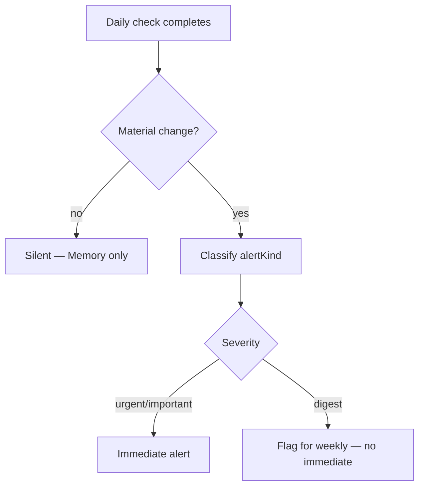

# Daily Alerts Specification

**Purpose:** What can fire **on the daily protection cycle** — the main driver of noise_rate denominator.

**Denominator:** `continuous_check_completed` (successful daily checks).  
**Target:** **&lt; 5%** of days generate a **user** immediate alert (Urgent + Important).

---

## Daily job → alert decision



---

## Daily-eligible alert types

| alertKind | Typical daily trigger |
|-----------|----------------------|
| AT-01 | New critical on incremental/full review |
| AT-02 | New high + material impact |
| AT-03 | Confidence cliff (BD-01) |
| AT-04 | Attack surface level up |
| AT-05 | New critical dependency advisory |
| AT-06 | Unsafe config in diff (BD-06) |
| AT-07 | Status regression after check |
| AT-08 | Watch stale (also evaluated daily) |
| AT-12 | Check failed 3x — watchdog |

**Not daily immediate:**

| alertKind | Routing |
|-----------|---------|
| AT-09, AT-10 | Event-driven (settings/integration) |
| AT-11 | On `can_i_deploy`, not cron |
| AT-13–15 | Weekly only |

---

## Material definition (daily)

Same as [continuous-protection/01](../continuous-protection/01-continuous-protection-specification.md):

- New critical/high (with gates for high)  
- Confidence drop ≥ 10 / 24h  
- Attack surface up  
- New critical dep advisory  
- Unsafe config diff  

**Non-material (silent):**

- Lockfile patch, no advisory  
- Comment-only SHA change  
- Medium finding if BD-02 not tripped  

---

## Daily alert content template

```
Should you worry?
{Yes — … | I need you to look before deploy.}

What changed:
• {max 3 bullets from snapshot diff}

What to do next:
{Single CTA}
```

**Timestamp:** “Detected during today's protection check.”

---

## Email rules (daily)

- Send only for **Urgent + Important** created that day  
- Max **1 email per project per day** (merge if multiple kinds same day — rare; prefer highest severity single email with top worry)

**Merge example:** AT-01 + AT-07 same day → one email, critical worry leads.

---

## Interaction with silent success

Days without alert:

- Do **not** send email  
- Update Protection Center “Last checked: today”  
- Increment weekly counter `checks_completed`  

---

## Metrics (daily)

| Metric | Formula | Target |
|--------|---------|--------|
| noise_rate | immediate_alerts / daily_checks | &lt; 5% |
| merge_rate | merged_emails / emails_sent | track |
| silent_day_rate | 1 - noise_rate | &gt; 95% |

---

## Acceptance criteria

- Fixture: 100 silent daily checks → 0 alerts.  
- Fixture: 1 critical finding → exactly 1 AT-01 with dedupe on re-run same day.
