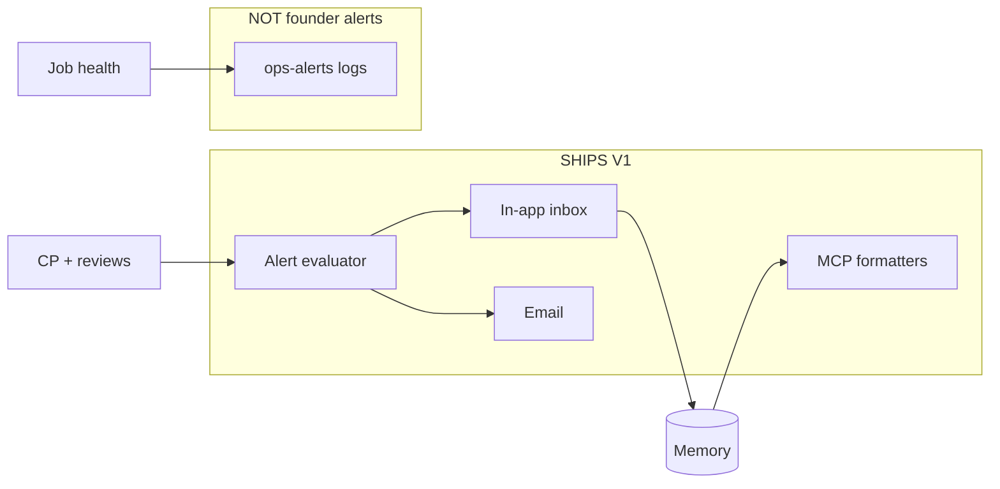

# Future Architecture and Scope

**User-facing Security Alerts** vs **ops alerts** vs **backlog integrations**.

---

## SHIPS NOW (Hybrid V1)

| Item | Doc |
|------|-----|
| Alert philosophy & noise target | 01 |
| 15 alert kinds AT-01–15 | 02 |
| 3 severity levels | 03 |
| In-app inbox + Protection Center banner | 04 |
| Evaluator + dedupe + resolve workflows | 05 |
| Daily immediate alerts (material) | 07 |
| Weekly summary + digest absorption | 08 |
| Monthly report alert rollup (not re-fire) | 09 |
| MCP parity via 5 tools | 10 |
| `alert_sent` Memory events | production-memory 01 |
| Email optional toggles | 04, 06 |
| Idempotent dedupe keys | 05 |

**Acceptance:** noise_rate &lt; 5%; false positive &lt; 5% of alerts (north star doc 12).

---

## ARCHITECTURE ONLY

| Item | Purpose |
|------|---------|
| Slack/Discord notification adapter | Same alert service, new channel |
| Push notifications (mobile) | Future app |
| User-configurable alert rules | Enterprise later |
| Per-alert-kind email toggles | Complexity — V1 uses channel toggles only |
| 7-day Urgent reminder job | Doc 03 optional |
| Alert outbox table | Email retry at scale |

---

## BACKLOG

| Item | Reason |
|------|--------|
| Real-time attack detection alerts | Explicit non-goal |
| SIEM / log streaming triggers | Not Year 1 |
| WAF/CDN event ingestion | Backlog |
| SMS paging | Noise + cost |
| “Every finding” email digests | Violates philosophy |
| Separate MCP `get_alerts` tool | Tool cap frozen |
| Cross-project alert rollup for agencies | GTM later |

---

## System boundary diagram

---

## Dependencies

- Continuous Protection daily job  
- Production Memory  
- Notification provider (email)  
- Protection status machine  

---

## Governance

New alert kinds require:

1. Bible doc 03 row or amendment  
2. Entry in doc 02 with dedupe + severity  
3. Noise impact estimate  

Default **reject** if expected to add &gt; 0.5% to noise_rate.

---

## Implementation order (when code allowed)

1. Alert record model + dedupe  
2. In-app inbox UI  
3. Evaluator wired to daily job material path  
4. Email + caps  
5. Auto-resolve on fix_verified  
6. Weekly/monthly rollup copy  
7. MCP string parity tests  
