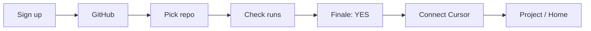
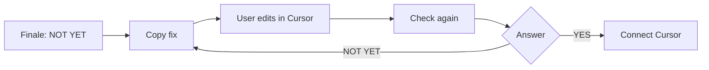
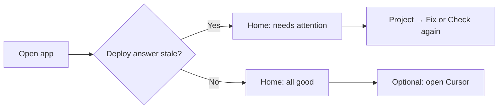

# User Journey Redesign

**Persona:** Founder, built SaaS with Cursor, never heard of DevOps/cyber.  
**Success:** Deploy answer → fix (if needed) → Ready to Ship → Cursor—in **&lt; 5 minutes**.

---

## Journey map (target state)

| Phase | User thought | Screen | Primary action | Time budget |
|-------|--------------|--------|----------------|-------------|
| Arrive | “Will this tell me if I can launch?” | Signup | Create account | 30s |
| Trust | “Is this legit?” | Welcome + GitHub trust line | Connect GitHub | 45s |
| Commit | “Which repo is my app?” | Repo picker | Select app | 30s |
| Wait | “How long?” | Review progress | *(wait)* | 90s P95 |
| Answer | “Can I ship?” | Finale hero | Read YES/NO | 15s |
| Fix | “What do I do?” | Fix card | Copy fix for Cursor | 60s |
| Verify | “Did that work?” | Same screen | Check again | 90s |
| Win | “I’m good!” | Hero → GO | Connect Cursor | 30s |
| Habit | “I’ll ask in Cursor next time” | Cursor wizard | Copy question | 60s |

**Total happy path (GO first try):** ~3 min  
**Fix loop once:** ~5 min  

---

## Journey A — Ready to ship (no blockers)

**Emotional beat:** Relief + celebration—not “scan complete.”

---

## Journey B — Not yet (one fix)

**Emotional beat:** Guided, not blamed—“Fix this first” not “3 critical vulnerabilities.”

---

## Journey C — Returning user (day 2)

**No new features:** Staleness = existing verdict age + analyze CTA.

---

## Touchpoints to remove from Journey v1

| Removed from golden path | Where user goes instead |
|--------------------------|-------------------------|
| Verdict “building” animation after scan | Auto finale |
| “View Production Verdict” button | User already on verdict |
| Dashboard entry interstitial | Primary CTA from finale |
| Technical Details | Week 2+ self-serve |
| Integrations multi-repo | After first app protected |
| Settings for MCP | Onboarding Cursor step |

---

## Emotional copy arc

1. **Signup:** Hope (“Ready to ship?”)
2. **GitHub:** Trust (read-only, no deploy)
3. **Waiting:** Calm (“Usually under 2 minutes”)
4. **NO-GO:** Agency (“Fix this first”)
5. **GO:** Pride (“You’re ready to ship”)
6. **Cursor:** Empowerment (“Ask anytime”)

---

## Confusion traps (current → fix)

| Trap | Fix |
|------|-----|
| “What’s Production Review?” | Rename to “Checking your app” |
| “I already see verdict—why View Verdict?” | Merge screens |
| “Where’s the fix?” | Fix card on finale |
| “What is MCP?” | “Connect Cursor” |
| “Dashboard vs project?” | One primary exit per state |

---

## Post-onboarding banner (`?onboarded=1`)

On project page, dismissible banner:

**GO:** “You’re ready to ship. Connect Cursor to check before every deploy.” [Connect Cursor]  
**NO-GO:** “Fix the issue above, then Check again.” [Dismiss]

---

## Metrics per journey stage (instrumentation)

| Stage | Event |
|-------|-------|
| onboarding_started | signup complete |
| github_connected | OAuth success |
| repo_selected | project id |
| first_verdict_shown | finale render |
| safe_fix_copied | clipboard |
| recheck_completed | second scan |
| ready_to_ship_shown | status GO |
| cursor_setup_completed | wizard finish |

Funnel dashboard for sprint retro—use existing analytics if present.

---

## Usability test script (5 users)

1. Sign up cold—think aloud through finale.  
2. Task: “You’re not ready to deploy—what do you do?” (must find copy fix).  
3. Task: “Connect SequrAI to Cursor.” (must finish in 60s with wizard).  
4. Question: “What does SequrAI do for you?” (expect “tells me if I can ship / helps fix”.)

**Pass:** 5/5 find fix; 4/5 Cursor setup without help.

---

## Alignment with Product Bible

Reframes “Production Verdict” as **deploy answer** in UX copy only—engine unchanged. Does not implement Continuous Protection, Memory, or alerts.
